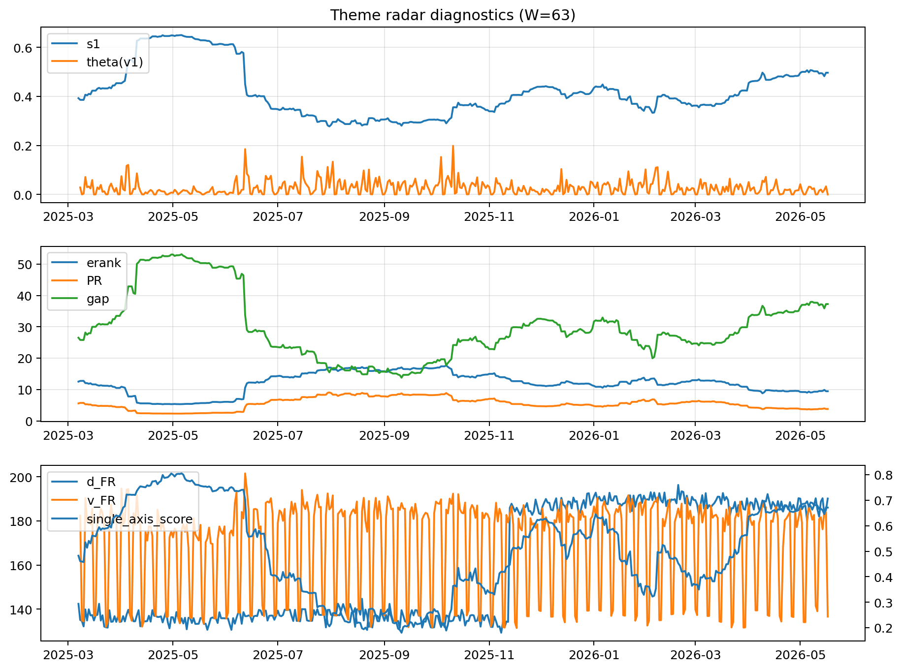

# Theme Radar Daily Brief — 2026-05-17

## Leaders (v1) — W=63
- **Nuclear_Uranium** (0.0749068471337132)
- Semis (0.0611722631876073)
- Genomics_Bio (0.050892128678455)

## Challengers — W=63
**v2:** Software_Cloud (0.1323955571287398), Cyber (0.0852181752119014), Grid_Power (0.0695632878346205)
**v3:** Nuclear_Uranium (0.1089784842015677), Rates (0.1087890937893681), Quantum (0.0682824290467874)

## Migration (20D slope) — W=63
**Top risers:**
- axis_Rates: 0.0004833884248385
- axis_Drones_Autonomy: 0.0003626203666396
- axis_Quantum: 0.0001817416914919
- axis_Metals: 0.0001369529926176
- axis_Defense: 0.0001203286637822
- axis_USD: 8.462972142211724e-05
- axis_DataCenter_Infra: 7.597290268448567e-05
- axis_Credit: 3.984638671706381e-05
- axis_Sector_Energy: 3.7885571407508767e-05
- axis_Sector_RealEstate: 3.45608160436448e-05

**Top fallers:**
- axis_Semis: -7.238452694238497e-05
- axis_Critical_Minerals: -7.244469648314306e-05
- axis_Grid_Power: -8.602248677154526e-05
- axis_Vol: -9.433965257793484e-05
- axis_Clean_Broad: -0.000100355686459
- axis_Sector_Health: -0.0001157848076493
- axis_Cyber: -0.0001507665129758
- axis_Crypto: -0.0001703139675076
- axis_Software_Cloud: -0.000201072248099
- axis_MegaCap_AI: -0.0003298115915397

## Risk line (W=63)
- s1: 0.4964368102423243
- theta_v1: 7.68688890123284e-05
- v_FR: 136.66054573673972
- single_axis_score: 0.6709382151029748

## Interpretation
**Regime:** `theme_migration`

- Action: Tomorrow watchlist: Rates, Drones_Autonomy, Quantum, Metals, Defense + v2_top1=Software_Cloud
- Action: Hedge note: normal correlation stability.

- Percentiles (W=63 history): vfr_pct=0.14, theta_pct=0.05, s1_pct=0.81, score_pct=0.80.

---
**BUNDLE_ROOT_SHA256:** `5d397944d61a48f213f607d0ca708704df2bf8e4275bd42196527e8e13a2ce89`
