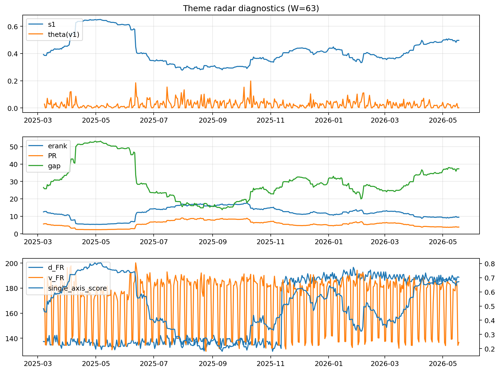

# Theme Radar Daily Brief — 2026-05-18

## Leaders (v1) — W=63
- **Nuclear_Uranium** (0.0748819818982098)
- Semis (0.0611650221397364)
- Genomics_Bio (0.0508812432553244)

## Challengers — W=63
**v2:** Software_Cloud (0.132347133468324), Cyber (0.0852035918214926), Grid_Power (0.0694803695577617)
**v3:** Nuclear_Uranium (0.1091757205872997), Rates (0.1085676963371079), Quantum (0.0682378786567125)

## Migration (20D slope) — W=63
**Top risers:**
- axis_Rates: 0.0004735926939221
- axis_Drones_Autonomy: 0.000330946863444
- axis_Quantum: 0.0001659172410374
- axis_Defense: 0.0001178838256611
- axis_Metals: 0.0001091772921651
- axis_DataCenter_Infra: 9.050738118583964e-05
- axis_USD: 7.7559552828416e-05
- axis_Credit: 4.658383763324033e-05
- axis_Sector_Energy: 4.2387130055387743e-05
- axis_Sector_RealEstate: 3.772585098601116e-05

**Top fallers:**
- axis_Sector_Fin: -5.708919163025603e-05
- axis_Grid_Power: -6.703951874082461e-05
- axis_Critical_Minerals: -7.137935632506438e-05
- axis_Clean_Broad: -8.590200696080042e-05
- axis_Vol: -9.20608177174619e-05
- axis_Sector_Health: -0.0001340330051907
- axis_Cyber: -0.0001459846655394
- axis_Crypto: -0.0001486198599759
- axis_Software_Cloud: -0.0001958481873819
- axis_MegaCap_AI: -0.0003066817914236

## Risk line (W=63)
- s1: 0.4965617259800208
- theta_v1: 0.0014443882599048
- v_FR: 136.64280564714355
- single_axis_score: 0.6721461187214611

## Interpretation
**Regime:** `theme_migration`

- Action: Tomorrow watchlist: Rates, Drones_Autonomy, Quantum, Defense, Metals + v2_top1=Software_Cloud
- Action: Hedge note: normal correlation stability.

- Percentiles (W=63 history): vfr_pct=0.14, theta_pct=0.23, s1_pct=0.82, score_pct=0.80.

---
**BUNDLE_ROOT_SHA256:** `e33025614313ee2a0ba35a7792aec9ac8033589c903afad54a8a5dda1dc8bec7`
