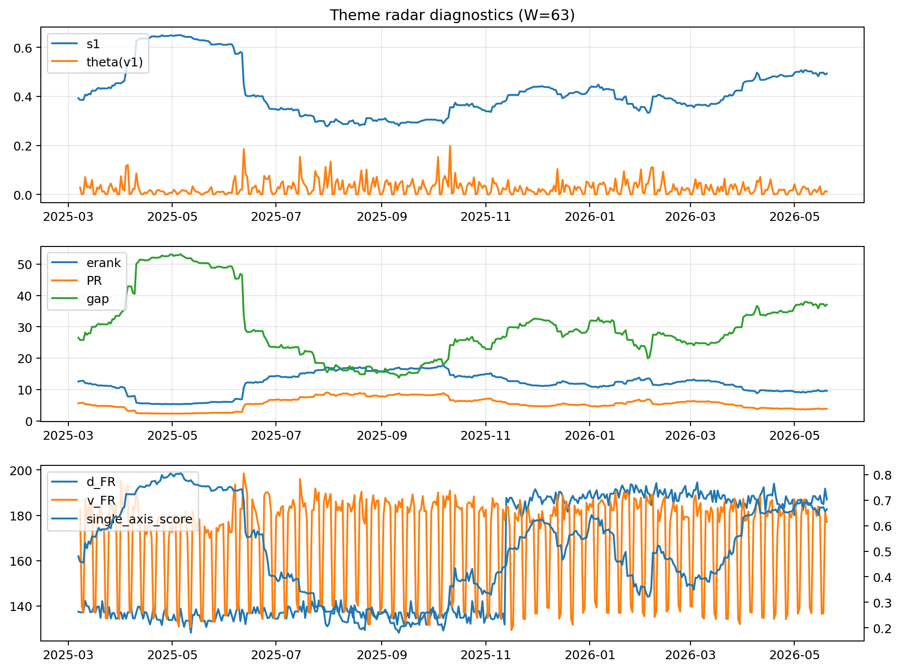

# Theme Radar Daily Brief — 2026-05-20

## Leaders (v1) — W=63
- **Nuclear_Uranium** (0.0754547971405062)
- Semis (0.0616624115374314)
- Genomics_Bio (0.0512575586008146)

## Challengers — W=63
**v2:** Software_Cloud (0.1343522025803067), Cyber (0.0869938626775749), Grid_Power (0.0716574501432914)
**v3:** Rates (0.1218168317201975), Nuclear_Uranium (0.1019771596300723), Quantum (0.0773761872527972)

## Migration (20D slope) — W=63
**Top risers:**
- axis_Rates: 0.000420404335853
- axis_Drones_Autonomy: 0.0002420807864335
- axis_Quantum: 0.0001381494201622
- axis_DataCenter_Infra: 0.0001058130481135
- axis_Defense: 9.258807858326022e-05
- axis_Metals: 7.839562346770803e-05
- axis_Sector_Energy: 6.811631681738608e-05
- axis_Credit: 6.60431986830579e-05
- axis_USD: 5.828508496085582e-05
- axis_Nuclear_Uranium: 5.224566414915788e-05

**Top fallers:**
- axis_Clean_Solar: -6.628697133546545e-05
- axis_Sector_ConsStap: -6.669209299785595e-05
- axis_Genomics_Bio: -7.09415031934308e-05
- axis_Sector_Fin: -8.335310854903512e-05
- axis_Vol: -8.938342311821663e-05
- axis_Crypto: -9.156772739181758e-05
- axis_Cyber: -0.0001191328683085
- axis_Sector_Health: -0.0001777486367525
- axis_Software_Cloud: -0.0001879381744869
- axis_MegaCap_AI: -0.0002358454570301

## Risk line (W=63)
- s1: 0.4933058193216545
- theta_v1: 0.0115919569225196
- v_FR: 177.05584690384592
- single_axis_score: 0.6645454545454546

## Interpretation
**Regime:** `theme_migration`

- Action: Tomorrow watchlist: Rates, Drones_Autonomy, Quantum, DataCenter_Infra, Defense + v2_top1=Software_Cloud
- Action: Hedge note: normal correlation stability.

- Percentiles (W=63 history): vfr_pct=0.37, theta_pct=0.36, s1_pct=0.81, score_pct=0.79.

---
**BUNDLE_ROOT_SHA256:** `9cd703f4c22527f49a24c2d16ab8aa015f291cefa966d42b115bb1dbb265d820`
