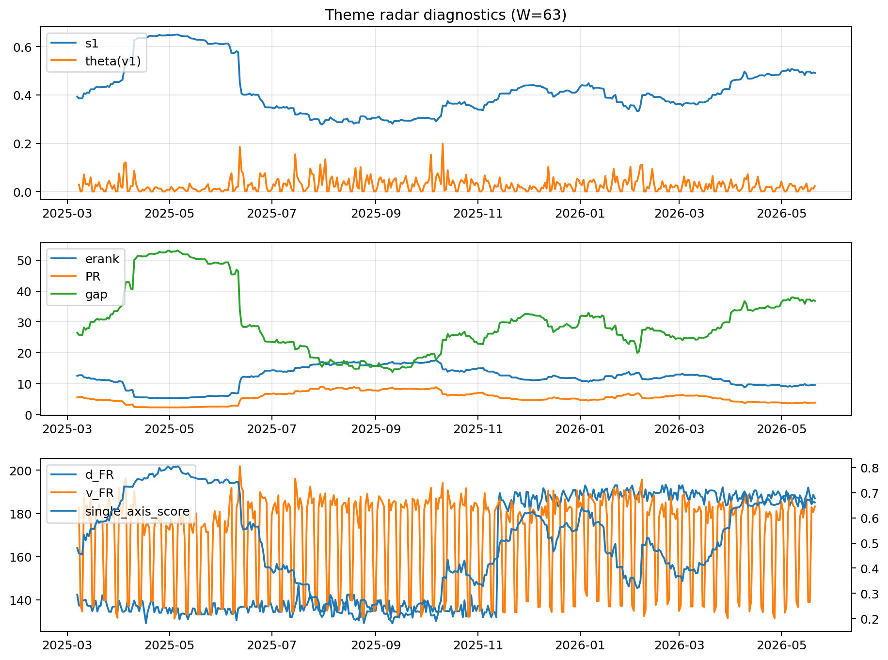

# Theme Radar Daily Brief — 2026-05-21

## Leaders (v1) — W=63
- **Nuclear_Uranium** (0.0759309114337485)
- Semis (0.0623284505537869)
- Genomics_Bio (0.0514041833203745)

## Challengers — W=63
**v2:** Software_Cloud (0.1330389628455898), Cyber (0.0860003362206915), Grid_Power (0.0700865792203077)
**v3:** Rates (0.120239984993512), Nuclear_Uranium (0.108358089020703), Quantum (0.0741615271684336)

## Migration (20D slope) — W=63
**Top risers:**
- axis_Rates: 0.0003891530978218
- axis_Drones_Autonomy: 0.0002135970466461
- axis_Quantum: 0.0001568084302261
- axis_DataCenter_Infra: 0.0001083372446914
- axis_Defense: 9.075504822447622e-05
- axis_Nuclear_Uranium: 8.5233154498687e-05
- axis_Sector_Energy: 7.821916969099409e-05
- axis_Credit: 6.869044097866664e-05
- axis_Metals: 6.316558423956613e-05
- axis_Miners: 5.159105152327648e-05

**Top fallers:**
- axis_Sector_Comm: -5.590874512260731e-05
- axis_Clean_Solar: -6.469005600322755e-05
- axis_Crypto: -8.930233408379988e-05
- axis_Vol: -8.942964728299596e-05
- axis_Sector_Fin: -9.301970335497352e-05
- axis_Sector_ConsStap: -9.914231083559182e-05
- axis_Cyber: -0.0001113767842931
- axis_Software_Cloud: -0.0001868743935493
- axis_Sector_Health: -0.0002030468888134
- axis_MegaCap_AI: -0.0002705402446156

## Risk line (W=63)
- s1: 0.4909419806328669
- theta_v1: 0.0228007056294223
- v_FR: 183.241501526866
- single_axis_score: 0.6612244897959183

## Interpretation
**Regime:** `theme_migration`

- Action: Tomorrow watchlist: Rates, Drones_Autonomy, Quantum, DataCenter_Infra, Defense + v2_top1=Software_Cloud
- Action: Hedge note: normal correlation stability.

- Percentiles (W=63 history): vfr_pct=0.67, theta_pct=0.56, s1_pct=0.80, score_pct=0.78.

---
**BUNDLE_ROOT_SHA256:** `6fcce516c394e39b8337575d31a736e3fe87ca81072fb49210b72af8a2420ab0`
