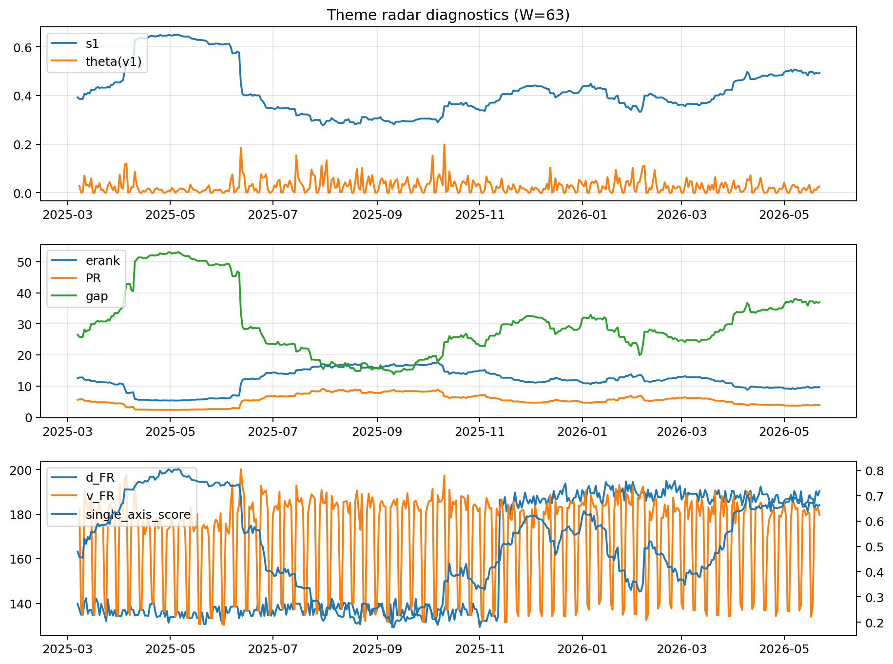

# Theme Radar Daily Brief — 2026-05-22

## Leaders (v1) — W=63
- **Nuclear_Uranium** (0.0759152319073832)
- Semis (0.0622804857760494)
- Genomics_Bio (0.0515737023125636)

## Challengers — W=63
**v2:** Software_Cloud (0.1342746728831119), Cyber (0.0873066400272778), Grid_Power (0.0700857384422194)
**v3:** Rates (0.120484015055152), Nuclear_Uranium (0.1090298441252276), Quantum (0.077700042334198)

## Migration (20D slope) — W=63
**Top risers:**
- axis_Rates: 0.0003651629298917
- axis_Drones_Autonomy: 0.0001727259239197
- axis_Quantum: 0.0001242585473644
- axis_DataCenter_Infra: 0.0001225028925684
- axis_Nuclear_Uranium: 0.0001078434912229
- axis_Sector_Energy: 8.466900577485869e-05
- axis_Defense: 8.421222699839333e-05
- axis_Credit: 7.521087422118826e-05
- axis_Metals: 7.360499123353049e-05
- axis_Miners: 6.310951754947772e-05

**Top fallers:**
- axis_Clean_Solar: -5.676729707909622e-05
- axis_Sector_Comm: -6.567712363219052e-05
- axis_Vol: -8.554762944664952e-05
- axis_Crypto: -9.366687349861782e-05
- axis_Sector_Fin: -9.844952702227672e-05
- axis_Cyber: -0.0001074185378143
- axis_Sector_ConsStap: -0.0001272393778017
- axis_Software_Cloud: -0.0001978776162363
- axis_Sector_Health: -0.0002124137100841
- axis_MegaCap_AI: -0.0003084716610733

## Risk line (W=63)
- s1: 0.4917816907963703
- theta_v1: 0.0251959798233082
- v_FR: 179.66724699535982
- single_axis_score: 0.66289592760181

## Interpretation
**Regime:** `theme_migration`

- Action: Tomorrow watchlist: Rates, Drones_Autonomy, Quantum, DataCenter_Infra, Nuclear_Uranium + v2_top1=Software_Cloud
- Action: Hedge note: normal correlation stability.

- Percentiles (W=63 history): vfr_pct=0.46, theta_pct=0.59, s1_pct=0.80, score_pct=0.79.

---
**BUNDLE_ROOT_SHA256:** `54a3c2bede59c1dc21dc329d9e04948fba19e30ef6bd267284dacda8f7a952f3`
