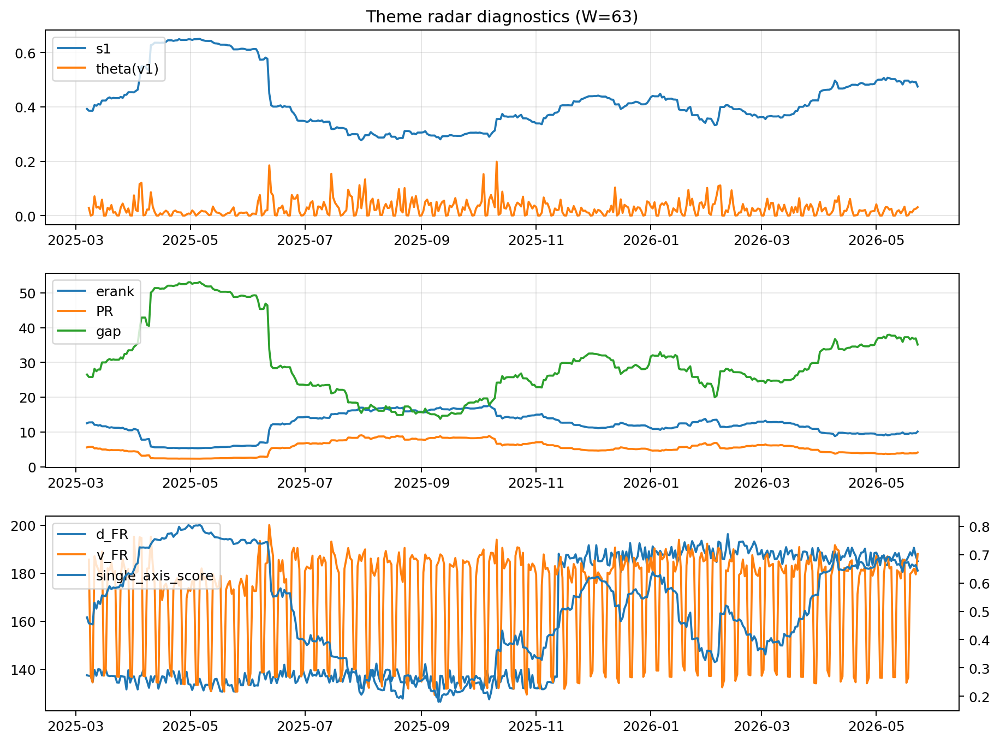

# Theme Radar Daily Brief — 2026-05-23

## Leaders (v1) — W=63
- **Nuclear_Uranium** (0.0773589539939083)
- Semis (0.0629993417220331)
- Genomics_Bio (0.0528044109980793)

## Challengers — W=63
**v2:** Software_Cloud (0.1323773378978354), Cyber (0.0869477264864796), Grid_Power (0.0682467324051908)
**v3:** Rates (0.1180380805073032), Nuclear_Uranium (0.0954509515984344), Quantum (0.073239617582973)

## Migration (20D slope) — W=63
**Top risers:**
- axis_Rates: 0.0003018935499123
- axis_Nuclear_Uranium: 0.0001483255502642
- axis_DataCenter_Infra: 0.0001254694932916
- axis_Drones_Autonomy: 0.0001087668811468
- axis_Quantum: 9.911640003544449e-05
- axis_Sector_Energy: 9.649874182349214e-05
- axis_Credit: 8.136263081751336e-05
- axis_Defense: 8.049351510026016e-05
- axis_Miners: 7.82698446209945e-05
- axis_Semis: 7.629039110496032e-05

**Top fallers:**
- axis_Clean_Solar: -4.804279029631651e-05
- axis_Sector_Comm: -7.259217099490438e-05
- axis_Crypto: -8.024313629403095e-05
- axis_Vol: -8.144619176134151e-05
- axis_Sector_Fin: -9.149997912778772e-05
- axis_Cyber: -0.0001166201717041
- axis_Sector_ConsStap: -0.0001581494683983
- axis_Sector_Health: -0.0002173739382798
- axis_Software_Cloud: -0.0002200484619339
- axis_MegaCap_AI: -0.0003541837569113

## Risk line (W=63)
- s1: 0.4747245921639778
- theta_v1: 0.031115525168687
- v_FR: 187.9637436759009
- single_axis_score: 0.6437923250564335

## Interpretation
**Regime:** `theme_migration`

- Action: Tomorrow watchlist: Rates, Nuclear_Uranium, DataCenter_Infra, Drones_Autonomy, Quantum + v2_top1=Software_Cloud
- Action: Hedge note: normal correlation stability.

- Percentiles (W=63 history): vfr_pct=0.90, theta_pct=0.68, s1_pct=0.76, score_pct=0.73.

---
**BUNDLE_ROOT_SHA256:** `6c9f73c198cfee27fe7245a89395f3e864f6621096af7fe99d83de8556edfa0b`
