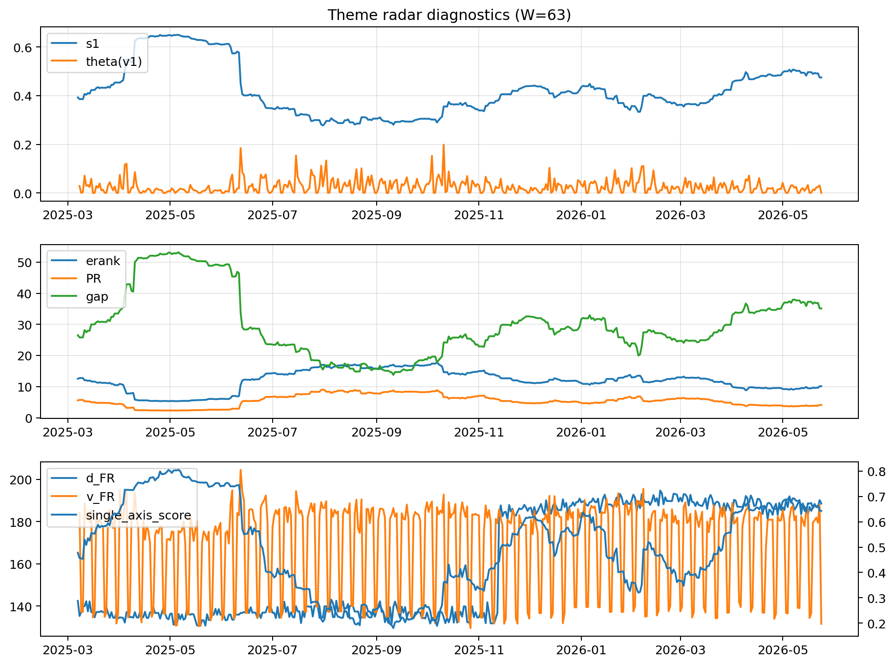

# Theme Radar Daily Brief — 2026-05-24

## Leaders (v1) — W=63
- **Nuclear_Uranium** (0.0773746056374903)
- Semis (0.062999747078761)
- Genomics_Bio (0.0528126923266469)

## Challengers — W=63
**v2:** Software_Cloud (0.1323984323165657), Cyber (0.0869091954103197), Grid_Power (0.0682881972487019)
**v3:** Rates (0.1181631206704805), Nuclear_Uranium (0.0952943124151876), Quantum (0.0733277823294164)

## Migration (20D slope) — W=63
**Top risers:**
- axis_Rates: 0.0002303074536774
- axis_Nuclear_Uranium: 0.0001840943288472
- axis_DataCenter_Infra: 0.0001261606377496
- axis_Sector_Energy: 0.0001037426963723
- axis_Semis: 0.000102794109807
- axis_Miners: 9.10743707880739e-05
- axis_Credit: 8.442678848641092e-05
- axis_Grid_Power: 7.89480020461456e-05
- axis_Defense: 7.353324718386585e-05
- axis_Quantum: 7.30890848660624e-05

**Top fallers:**
- axis_Clean_Solar: -3.765217330478525e-05
- axis_Crypto: -6.286961120854941e-05
- axis_Vol: -7.488883447085417e-05
- axis_Sector_Comm: -7.807701709517348e-05
- axis_Sector_Fin: -8.333741224014774e-05
- axis_Cyber: -0.0001220058026443
- axis_Sector_ConsStap: -0.0001835490538973
- axis_Sector_Health: -0.0002166206260659
- axis_Software_Cloud: -0.0002352614939946
- axis_MegaCap_AI: -0.0003914766132962

## Risk line (W=63)
- s1: 0.4746804754117343
- theta_v1: 0.0006789601720665
- v_FR: 131.6300563681531
- single_axis_score: 0.6432432432432432

## Interpretation
**Regime:** `theme_migration`

- Action: Tomorrow watchlist: Rates, Nuclear_Uranium, DataCenter_Infra, Sector_Energy, Semis + v2_top1=Software_Cloud
- Action: Hedge note: normal correlation stability.

- Percentiles (W=63 history): vfr_pct=0.01, theta_pct=0.19, s1_pct=0.75, score_pct=0.73.

---
**BUNDLE_ROOT_SHA256:** `907862fd29a35a21c748511e7a73922acbbda80bf7e50c171259079a59342e94`
