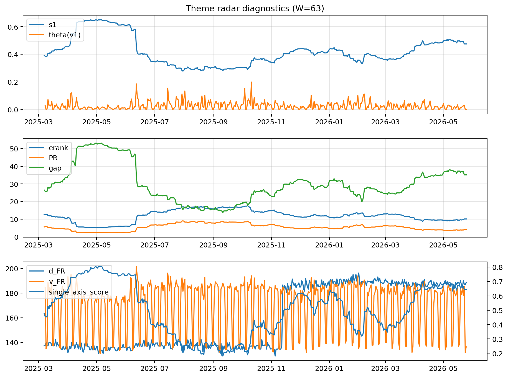

# Theme Radar Daily Brief — 2026-05-25

## Leaders (v1) — W=63
- **Nuclear_Uranium** (0.0773772123185835)
- Semis (0.0629992338485518)
- Genomics_Bio (0.0528141830074887)

## Challengers — W=63
**v2:** Software_Cloud (0.1324021331507071), Cyber (0.0868992288113996), Grid_Power (0.0682960992237409)
**v3:** Rates (0.1181856352228281), Nuclear_Uranium (0.0952698065257075), Quantum (0.0733444620716542)

## Migration (20D slope) — W=63
**Top risers:**
- axis_Nuclear_Uranium: 0.0002260659676115
- axis_Rates: 0.0001652971943315
- axis_DataCenter_Infra: 0.0001216151938877
- axis_Semis: 0.0001212770099256
- axis_Sector_Energy: 0.0001089551922054
- axis_Grid_Power: 0.0001020570306503
- axis_Miners: 9.915461574933666e-05
- axis_Genomics_Bio: 9.025755154205306e-05
- axis_Credit: 8.3356385450784e-05
- axis_USD: 7.540668354855856e-05

**Top fallers:**
- axis_Sector_RealEstate: -4.7554972154947525e-05
- axis_Crypto: -4.855921431197938e-05
- axis_Vol: -6.52635134819635e-05
- axis_Sector_Fin: -7.44684582048069e-05
- axis_Sector_Comm: -8.3214248632694e-05
- axis_Cyber: -0.0001306844281073
- axis_Sector_ConsStap: -0.0002001921745453
- axis_Sector_Health: -0.0002095891816025
- axis_Software_Cloud: -0.0002549092486864
- axis_MegaCap_AI: -0.0004215609323397

## Risk line (W=63)
- s1: 0.4746754238885872
- theta_v1: 8.38202185262339e-05
- v_FR: 136.40646249420672
- single_axis_score: 0.642247191011236

## Interpretation
**Regime:** `theme_migration`

- Action: Tomorrow watchlist: Nuclear_Uranium, Rates, DataCenter_Infra, Semis, Sector_Energy + v2_top1=Software_Cloud
- Action: Hedge note: normal correlation stability.

- Percentiles (W=63 history): vfr_pct=0.11, theta_pct=0.05, s1_pct=0.75, score_pct=0.73.

---
**BUNDLE_ROOT_SHA256:** `24180849facab3070760d057210cea2895c64acec62b4c8de6151f6d9c0b9882`
