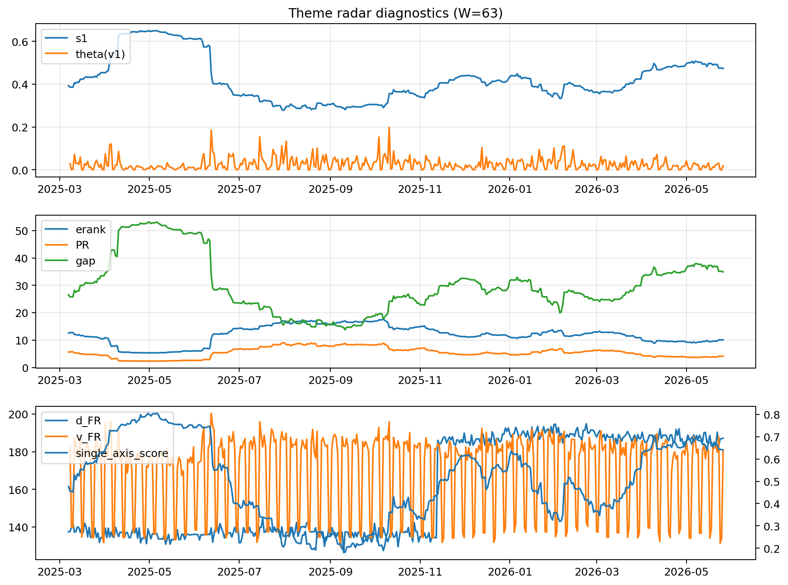

# Theme Radar Daily Brief — 2026-05-26

## Leaders (v1) — W=63
- **Nuclear_Uranium** (0.0772547053001913)
- Semis (0.0629845851153232)
- Genomics_Bio (0.0527825968422787)

## Challengers — W=63
**v2:** Software_Cloud (0.1314941803092902), Cyber (0.0861810080590929), Grid_Power (0.0676449952818301)
**v3:** Rates (0.1166311269433494), Nuclear_Uranium (0.0961156908555553), Quantum (0.0717693711262753)

## Migration (20D slope) — W=63
**Top risers:**
- axis_Nuclear_Uranium: 0.0002381486645891
- axis_Sector_Energy: 0.0001300567959936
- axis_Semis: 0.0001191140955986
- axis_DataCenter_Infra: 0.0001188694352623
- axis_Rates: 0.0001079386003006
- axis_Grid_Power: 0.0001078617543322
- axis_Miners: 0.0001014053074987
- axis_Credit: 9.03306092767878e-05
- axis_Genomics_Bio: 8.081349062575701e-05
- axis_USD: 7.932036217534842e-05

**Top fallers:**
- axis_Vol: -5.157026207400967e-05
- axis_Drones_Autonomy: -5.512982146339999e-05
- axis_Sector_RealEstate: -5.866828776334227e-05
- axis_Sector_Fin: -6.227710364785934e-05
- axis_Sector_Comm: -8.013209397322742e-05
- axis_Cyber: -0.0001232780353779
- axis_Sector_Health: -0.0001944975983744
- axis_Sector_ConsStap: -0.0002173214422531
- axis_Software_Cloud: -0.000251256636444
- axis_MegaCap_AI: -0.0004260231250491

## Risk line (W=63)
- s1: 0.4732234615954109
- theta_v1: 0.0186102851448436
- v_FR: 180.33800368680932
- single_axis_score: 0.6403587443946188

## Interpretation
**Regime:** `theme_migration`

- Action: Tomorrow watchlist: Nuclear_Uranium, Sector_Energy, Semis, DataCenter_Infra, Rates + v2_top1=Software_Cloud
- Action: Hedge note: normal correlation stability.

- Percentiles (W=63 history): vfr_pct=0.50, theta_pct=0.49, s1_pct=0.75, score_pct=0.73.

---
**BUNDLE_ROOT_SHA256:** `e660490e6dc2755edb624a9dd05a87f44458fa698bf1e3024d6ea72cd8ce0fee`
