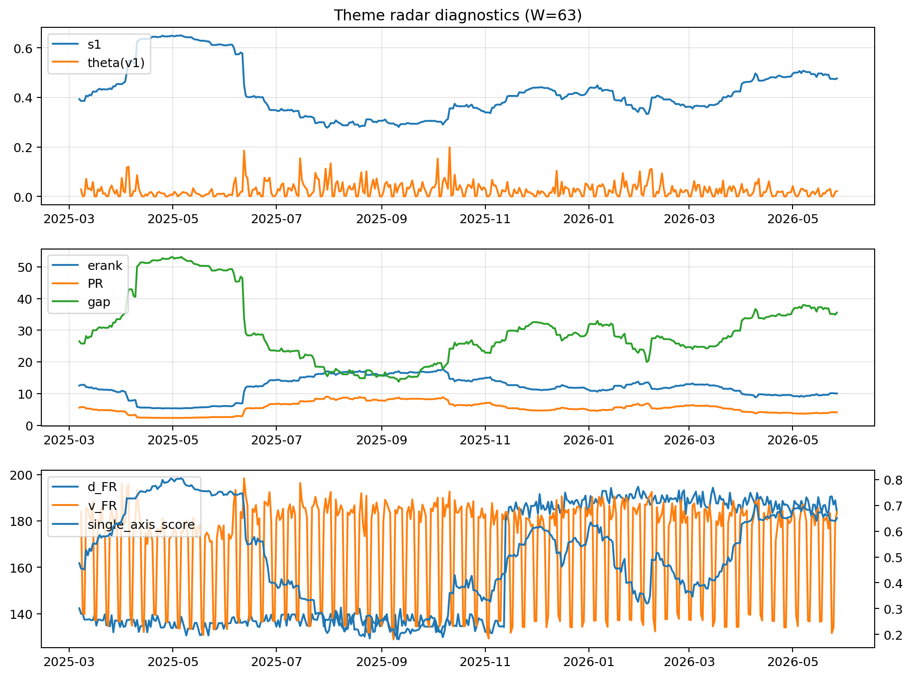

# Theme Radar Daily Brief — 2026-05-27

## Leaders (v1) — W=63
- **Nuclear_Uranium** (0.0779746104551385)
- Semis (0.0633141537036301)
- Genomics_Bio (0.0528467655084711)

## Challengers — W=63
**v2:** Software_Cloud (0.1364067796792362), Cyber (0.0889909211035324), Crypto (0.0673871075719883)
**v3:** Rates (0.1006881281896604), Nuclear_Uranium (0.0952976127878242), Space (0.0639638843628731)

## Migration (20D slope) — W=63
**Top risers:**
- axis_Nuclear_Uranium: 0.0002710735187665
- axis_Sector_Energy: 0.0001610918452788
- axis_Grid_Power: 0.0001322652908053
- axis_DataCenter_Infra: 0.0001187597880115
- axis_Semis: 0.0001144888598935
- axis_Miners: 0.0001072110014133
- axis_Metals: 9.641951276141208e-05
- axis_Credit: 9.461131429621528e-05
- axis_Genomics_Bio: 8.642147925974878e-05
- axis_USD: 8.14494788219787e-05

**Top fallers:**
- axis_Sector_Fin: -5.501466566563424e-05
- axis_Sector_RealEstate: -6.627418461293588e-05
- axis_Sector_Comm: -7.539691229945589e-05
- axis_Crypto: -7.596641025758734e-05
- axis_Drones_Autonomy: -8.039676253577589e-05
- axis_Cyber: -0.0001360935986485
- axis_Sector_Health: -0.0001884721588478
- axis_Sector_ConsStap: -0.0002375218155313
- axis_Software_Cloud: -0.0002735147784951
- axis_MegaCap_AI: -0.0004346362467722

## Risk line (W=63)
- s1: 0.4763674517171449
- theta_v1: 0.0218884286034773
- v_FR: 183.92130974243017
- single_axis_score: 0.6505592841163311

## Interpretation
**Regime:** `theme_migration`

- Action: Tomorrow watchlist: Nuclear_Uranium, Sector_Energy, Grid_Power, DataCenter_Infra, Semis + v2_top1=Software_Cloud
- Action: Hedge note: normal correlation stability.

- Percentiles (W=63 history): vfr_pct=0.68, theta_pct=0.55, s1_pct=0.76, score_pct=0.75.

---
**BUNDLE_ROOT_SHA256:** `d58f3cbd3416dd819c3f5d0fec4b3300dde832274f9f4709586c0ef48e58fb3b`
