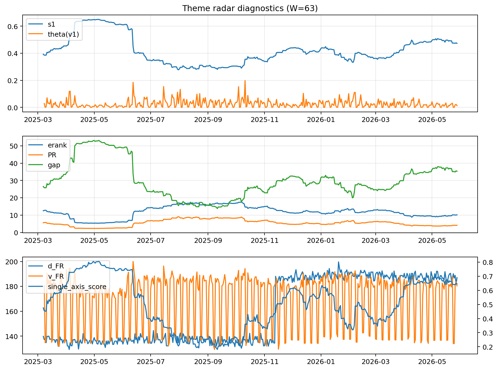

# Theme Radar Daily Brief — 2026-05-28

## Leaders (v1) — W=63
- **Nuclear_Uranium** (0.0786583396625029)
- Semis (0.0637573975677062)
- Genomics_Bio (0.052373108783344)

## Challengers — W=63
**v2:** Software_Cloud (0.1379113096298344), Cyber (0.0880939093746885), Crypto (0.0705895380627253)
**v3:** Rates (0.1022238901038494), Nuclear_Uranium (0.09345452657058), Space (0.070702797915419)

## Migration (20D slope) — W=63
**Top risers:**
- axis_Nuclear_Uranium: 0.0003116981623863
- axis_Sector_Energy: 0.0001757943615071
- axis_Grid_Power: 0.00016333831811
- axis_Semis: 0.0001389020517695
- axis_DataCenter_Infra: 0.0001238228084152
- axis_Miners: 0.0001064051750506
- axis_Metals: 9.950311664609128e-05
- axis_Credit: 9.688459636399476e-05
- axis_USD: 8.682848611298717e-05
- axis_Genomics_Bio: 7.560906151307045e-05

**Top fallers:**
- axis_Sector_RealEstate: -6.920280208679017e-05
- axis_Sector_Comm: -6.983970956349481e-05
- axis_Quantum: -7.38383406365872e-05
- axis_Crypto: -0.000101169934469
- axis_Drones_Autonomy: -0.0001036985913236
- axis_Cyber: -0.0001583641972736
- axis_Sector_Health: -0.0001816651004168
- axis_Sector_ConsStap: -0.0002624228947229
- axis_Software_Cloud: -0.0002825573353333
- axis_MegaCap_AI: -0.0004315874912212

## Risk line (W=63)
- s1: 0.4726804459824007
- theta_v1: 0.0129627096872063
- v_FR: 180.34828671951848
- single_axis_score: 0.6450892857142858

## Interpretation
**Regime:** `theme_migration`

- Action: Tomorrow watchlist: Nuclear_Uranium, Sector_Energy, Grid_Power, Semis, DataCenter_Infra + v2_top1=Software_Cloud
- Action: Hedge note: normal correlation stability.

- Percentiles (W=63 history): vfr_pct=0.49, theta_pct=0.40, s1_pct=0.75, score_pct=0.75.

---
**BUNDLE_ROOT_SHA256:** `2e36e8d92f9f4e84f9f34e8445e81cd764ffea5191430aebff81ca715a26335b`
