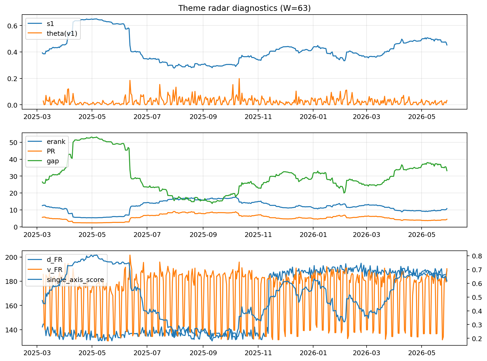

# Theme Radar Daily Brief — 2026-05-29

## Leaders (v1) — W=63
- **Nuclear_Uranium** (0.0795478605990227)
- Semis (0.0634480371751949)
- Genomics_Bio (0.056429902052268)

## Challengers — W=63
**v2:** Software_Cloud (0.134117027285224), Cyber (0.0851775577860522), Crypto (0.065774694145759)
**v3:** Rates (0.1167331680532646), Nuclear_Uranium (0.091746757164216), Space (0.0696160966324931)

## Migration (20D slope) — W=63
**Top risers:**
- axis_Nuclear_Uranium: 0.0003313371816038
- axis_Sector_Energy: 0.0001894026048536
- axis_Grid_Power: 0.0001696826379371
- axis_Semis: 0.000150654903431
- axis_Genomics_Bio: 0.0001385537056912
- axis_DataCenter_Infra: 0.000117721544428
- axis_Miners: 0.0001135124023492
- axis_Metals: 0.0001056666320097
- axis_Credit: 9.841358951353694e-05
- axis_USD: 9.81119656110438e-05

**Top fallers:**
- axis_Sector_Comm: -7.216992190224453e-05
- axis_Sector_Utilities: -7.420158669994881e-05
- axis_Quantum: -8.606344267775831e-05
- axis_Drones_Autonomy: -0.000119069375742
- axis_Cyber: -0.0001604044518936
- axis_Crypto: -0.0001685680763238
- axis_Sector_Health: -0.000170073112295
- axis_Sector_ConsStap: -0.0002811510585702
- axis_Software_Cloud: -0.0002912449888466
- axis_MegaCap_AI: -0.0004368577221861

## Risk line (W=63)
- s1: 0.4526692608928447
- theta_v1: 0.0329330734518501
- v_FR: 190.29064539496952
- single_axis_score: 0.6155902004454342

## Interpretation
**Regime:** `structure_rewrite`

- Action: Tomorrow watchlist: Nuclear_Uranium, Sector_Energy, Grid_Power, Semis, Genomics_Bio + v2_top1=Software_Cloud
- Action: Hedge note: v_FR high → structure is re-writing; treat correlation assumptions as fragile.

- Percentiles (W=63 history): vfr_pct=0.96, theta_pct=0.71, s1_pct=0.70, score_pct=0.69.

---
**BUNDLE_ROOT_SHA256:** `1eef32db2a6713f82dea5806947c68bcf60f848a0daddfee9c8f70ca6f5a7714`
