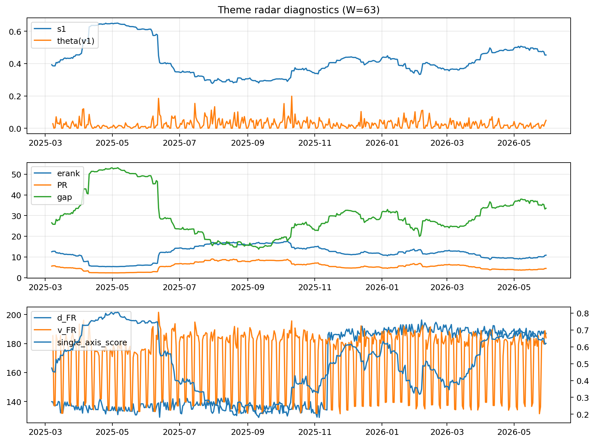

# Theme Radar Daily Brief — 2026-05-30

## Leaders (v1) — W=63
- **Nuclear_Uranium** (0.0803725681905166)
- Semis (0.0630647744082704)
- Genomics_Bio (0.0554450646864672)

## Challengers — W=63
**v2:** Software_Cloud (0.1535315184135297), Cyber (0.0968542802579972), MegaCap_AI (0.0782041111440045)
**v3:** Rates (0.111706587193587), Nuclear_Uranium (0.0957731580901611), Space (0.081447145672147)

## Migration (20D slope) — W=63
**Top risers:**
- axis_Nuclear_Uranium: 0.0003526385434082
- axis_Sector_Energy: 0.0001963181493071
- axis_Metals: 0.0001860098989171
- axis_Grid_Power: 0.0001817343249694
- axis_Genomics_Bio: 0.0001801412832838
- axis_Semis: 0.0001537177137505
- axis_Miners: 0.0001395790715268
- axis_DataCenter_Infra: 0.000120006015747
- axis_USD: 0.0001087073744055
- axis_Equity_US: 0.0001008894090827

**Top fallers:**
- axis_Sector_Utilities: -8.400073208224599e-05
- axis_Quantum: -0.0001079254107962
- axis_Space: -0.0001161063667544
- axis_Drones_Autonomy: -0.0001421445986334
- axis_Sector_Health: -0.0001595960320067
- axis_Cyber: -0.0001966151052857
- axis_Crypto: -0.0002602952547247
- axis_Sector_ConsStap: -0.0002838501961878
- axis_Software_Cloud: -0.0003160484261633
- axis_MegaCap_AI: -0.0004624509686488

## Risk line (W=63)
- s1: 0.452908450463255
- theta_v1: 0.0492114642470773
- v_FR: 183.97829313230403
- single_axis_score: 0.6204444444444445

## Interpretation
**Regime:** `theme_migration`

- Action: Tomorrow watchlist: Nuclear_Uranium, Sector_Energy, Metals, Grid_Power, Genomics_Bio + v2_top1=Software_Cloud
- Action: Hedge note: normal correlation stability.

- Percentiles (W=63 history): vfr_pct=0.70, theta_pct=0.84, s1_pct=0.70, score_pct=0.70.

---
**BUNDLE_ROOT_SHA256:** `981f4a499d6550aff45e8d55937e42907992385778895c7e166659be0372a69d`
