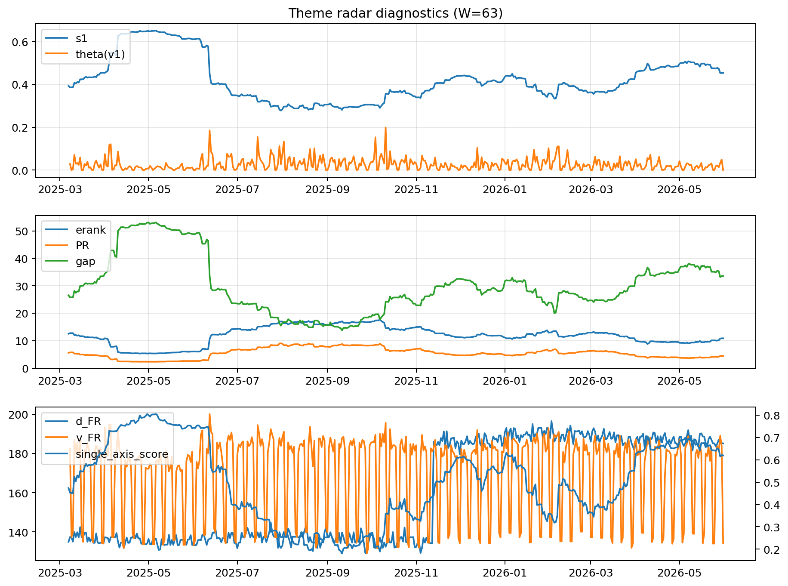

# Theme Radar Daily Brief — 2026-05-31

## Leaders (v1) — W=63
- **Nuclear_Uranium** (0.0803761464886839)
- Semis (0.0630663161514244)
- Genomics_Bio (0.055446800563491)

## Challengers — W=63
**v2:** Software_Cloud (0.1535437990012088), Cyber (0.0968598219895515), MegaCap_AI (0.0782181211333759)
**v3:** Rates (0.1117162550142529), Nuclear_Uranium (0.0957596155510323), Space (0.0814489278148596)

## Migration (20D slope) — W=63
**Top risers:**
- axis_Nuclear_Uranium: 0.0003627031532519
- axis_Metals: 0.0002568928754672
- axis_Genomics_Bio: 0.000215991491491
- axis_Sector_Energy: 0.0001993976093399
- axis_Grid_Power: 0.0001882824375349
- axis_Miners: 0.0001600702420694
- axis_Semis: 0.0001541545840166
- axis_DataCenter_Infra: 0.0001173222883571
- axis_USD: 0.0001161679226586
- axis_Equity_US: 0.0001155488958761

**Top fallers:**
- axis_Sector_Utilities: -9.329407704732798e-05
- axis_Quantum: -0.0001270716208242
- axis_Sector_Health: -0.0001439341234592
- axis_Drones_Autonomy: -0.0001602190598669
- axis_Space: -0.0001635267479085
- axis_Cyber: -0.0002251437353211
- axis_Sector_ConsStap: -0.0002795370328394
- axis_Software_Cloud: -0.0003310199983524
- axis_Crypto: -0.0003425441554474
- axis_MegaCap_AI: -0.0004721430023966

## Risk line (W=63)
- s1: 0.4528986690189415
- theta_v1: 0.0002306464017782
- v_FR: 134.18689537099635
- single_axis_score: 0.6195121951219512

## Interpretation
**Regime:** `theme_migration`

- Action: Tomorrow watchlist: Nuclear_Uranium, Metals, Genomics_Bio, Sector_Energy, Grid_Power + v2_top1=Software_Cloud
- Action: Hedge note: normal correlation stability.

- Percentiles (W=63 history): vfr_pct=0.06, theta_pct=0.10, s1_pct=0.70, score_pct=0.69.

---
**BUNDLE_ROOT_SHA256:** `21f04bf9fb5ed49dcf1b2b155588b10f3432bf45945b2ea22b97ad3eec0a8bb4`
