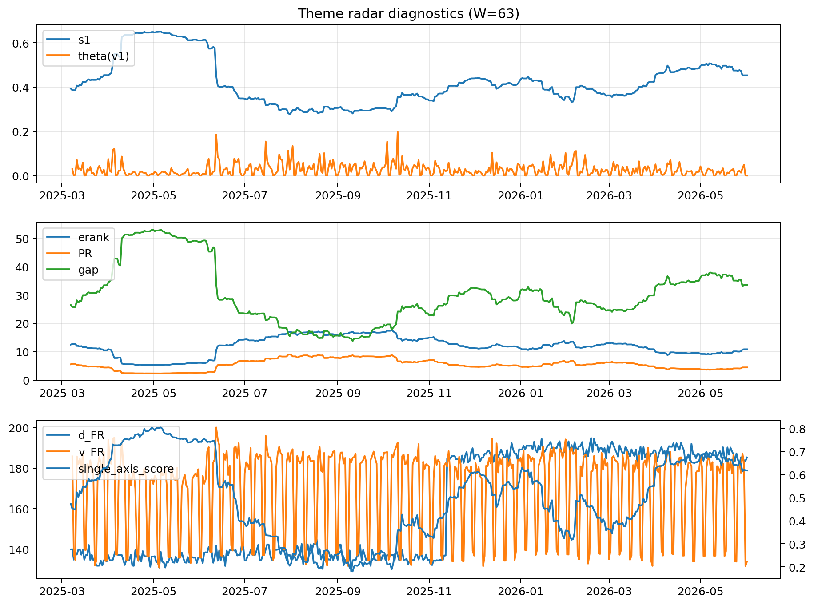

# Theme Radar Daily Brief — 2026-06-01

## Leaders (v1) — W=63
- **Nuclear_Uranium** (0.0803765084546232)
- Semis (0.0630664279271602)
- Genomics_Bio (0.0554470044885462)

## Challengers — W=63
**v2:** Software_Cloud (0.1535457436545815), Cyber (0.0968609112689394), MegaCap_AI (0.0782196650213585)
**v3:** Rates (0.1117126657654622), Nuclear_Uranium (0.0957624165518108), Space (0.0814488385494921)

## Migration (20D slope) — W=63
**Top risers:**
- axis_Nuclear_Uranium: 0.0003637072816093
- axis_Metals: 0.0003184067606629
- axis_Genomics_Bio: 0.0002378921987071
- axis_Sector_Energy: 0.0001916216334158
- axis_Grid_Power: 0.0001915807520939
- axis_Miners: 0.0001805552288106
- axis_Semis: 0.0001475585119085
- axis_Equity_US: 0.0001326799329607
- axis_Critical_Minerals: 0.0001249687184874
- axis_USD: 0.0001236741883145

**Top fallers:**
- axis_Sector_Utilities: -0.0001005455022244
- axis_Sector_Health: -0.0001244634725271
- axis_Quantum: -0.000140697709004
- axis_Drones_Autonomy: -0.0001731227248111
- axis_Space: -0.0001977050712611
- axis_Cyber: -0.0002461247369515
- axis_Sector_ConsStap: -0.0002716799531895
- axis_Software_Cloud: -0.0003367653523735
- axis_Crypto: -0.0004235123130446
- axis_MegaCap_AI: -0.0004746593379185

## Risk line (W=63)
- s1: 0.4528978572549237
- theta_v1: 8.855183893388986e-05
- v_FR: 133.89728437546077
- single_axis_score: 0.6185840707964603

## Interpretation
**Regime:** `theme_migration`

- Action: Tomorrow watchlist: Nuclear_Uranium, Metals, Genomics_Bio, Sector_Energy, Grid_Power + v2_top1=Software_Cloud
- Action: Hedge note: normal correlation stability.

- Percentiles (W=63 history): vfr_pct=0.03, theta_pct=0.06, s1_pct=0.70, score_pct=0.69.

---
**BUNDLE_ROOT_SHA256:** `ad055a8a07abf113bb649e4c6e1ddb3096e37172a0990356a5c6f3e3ac5f8874`
