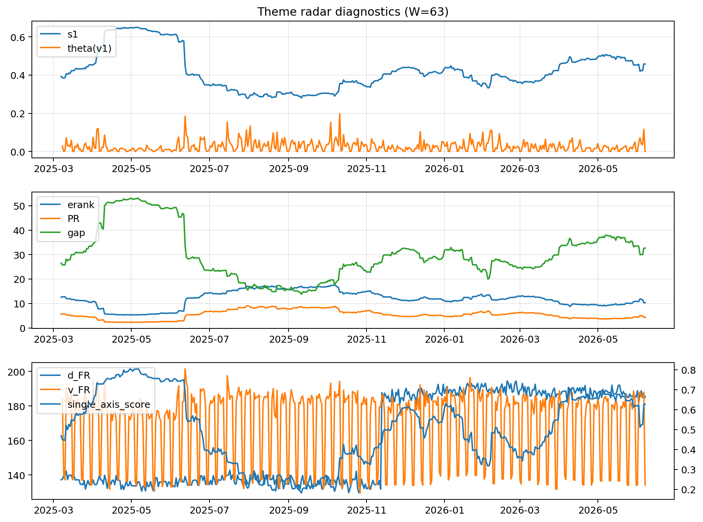

# Theme Radar Daily Brief — 2026-06-07

## Leaders (v1) — W=63
- **Nuclear_Uranium** (0.0802191725626579)
- Semis (0.0593776751908044)
- Metals (0.0548141650988109)

## Challengers — W=63
**v2:** Software_Cloud (0.1220246508650585), Cyber (0.0804216777650622), MegaCap_AI (0.07471990454114)
**v3:** Genomics_Bio (0.1124970560389901), Semis (0.0961099465798881), Grid_Power (0.0669631813300209)

## Migration (20D slope) — W=63
**Top risers:**
- axis_Rates: 0.0007123328699321
- axis_Metals: 0.0005890248928159
- axis_Nuclear_Uranium: 0.0003235863266816
- axis_Critical_Minerals: 0.0002570709352409
- axis_Miners: 0.0002232496491868
- axis_Credit: 0.0001503490909097
- axis_Equity_US: 0.000149017081024
- axis_Sector_Materials: 0.0001269214761
- axis_USD: 0.0001208738564679
- axis_Grid_Power: 9.612193941646516e-05

**Top fallers:**
- axis_Space: -9.76347109872262e-05
- axis_Drones_Autonomy: -0.0001222621108639
- axis_Sector_Comm: -0.0001358062709149
- axis_Sector_ConsStap: -0.0001654976734301
- axis_Semis: -0.0001933557379231
- axis_Sector_Health: -0.0002035776632362
- axis_Cyber: -0.0002551672271978
- axis_Software_Cloud: -0.0003088572659182
- axis_Crypto: -0.0005161841596976
- axis_MegaCap_AI: -0.0006049764043516

## Risk line (W=63)
- s1: 0.4580270257750087
- theta_v1: 0.0002177728859811
- v_FR: 134.19882886026514
- single_axis_score: 0.6266375545851528

## Interpretation
**Regime:** `theme_migration`

- Action: Tomorrow watchlist: Rates, Metals, Nuclear_Uranium, Critical_Minerals, Miners + v2_top1=Software_Cloud
- Action: Hedge note: normal correlation stability.

- Percentiles (W=63 history): vfr_pct=0.07, theta_pct=0.10, s1_pct=0.72, score_pct=0.71.

---
**BUNDLE_ROOT_SHA256:** `64bc1f51f9b7bf14feb221959a8d3680499a3dac77b3996d41a5973e8694822e`
