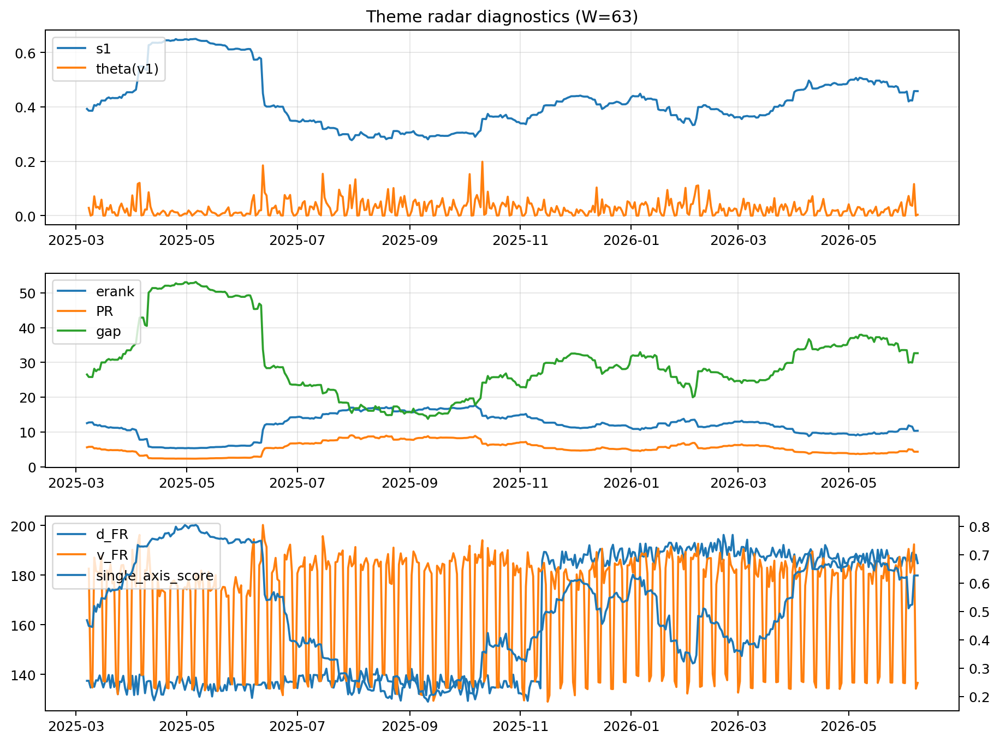

# Theme Radar Daily Brief — 2026-06-08

## Leaders (v1) — W=63
- **Nuclear_Uranium** (0.0802720912520205)
- Semis (0.0594000092418154)
- Metals (0.0548473474712302)

## Challengers — W=63
**v2:** Software_Cloud (0.1220647075790789), Cyber (0.0804870408919271), MegaCap_AI (0.0748346521997561)
**v3:** Genomics_Bio (0.1124521560031531), Semis (0.0960773072320651), Grid_Power (0.0671019163089482)

## Migration (20D slope) — W=63
**Top risers:**
- axis_Rates: 0.000791732360576
- axis_Metals: 0.0006005056928323
- axis_Nuclear_Uranium: 0.0002982080849199
- axis_Critical_Minerals: 0.0002694544745754
- axis_Miners: 0.0002145121758854
- axis_Credit: 0.0001416151690188
- axis_Equity_US: 0.0001349419614127
- axis_Sector_Materials: 0.0001146578299751
- axis_USD: 0.0001050910550422
- axis_Clean_Broad: 7.330272148387874e-05

**Top fallers:**
- axis_Genomics_Bio: -9.880575813145028e-05
- axis_Commodities: -0.0001077377130396
- axis_Sector_Comm: -0.0001382668193721
- axis_Sector_ConsStap: -0.0001460923562322
- axis_Cyber: -0.0002131670787086
- axis_Sector_Health: -0.0002212984024847
- axis_Semis: -0.0002267294340379
- axis_Software_Cloud: -0.000272480433701
- axis_Crypto: -0.000427299889497
- axis_MegaCap_AI: -0.0005761838512648

## Risk line (W=63)
- s1: 0.4578306194420578
- theta_v1: 0.0034042701162715
- v_FR: 136.55994011436627
- single_axis_score: 0.6265795206971678

## Interpretation
**Regime:** `theme_migration`

- Action: Tomorrow watchlist: Rates, Metals, Nuclear_Uranium, Critical_Minerals, Miners + v2_top1=Software_Cloud
- Action: Hedge note: normal correlation stability.

- Percentiles (W=63 history): vfr_pct=0.16, theta_pct=0.27, s1_pct=0.72, score_pct=0.71.

---
**BUNDLE_ROOT_SHA256:** `047c85c18b9dc293ad652681bfc2b116d319706fcd14fd09b17f732e363bb04c`
