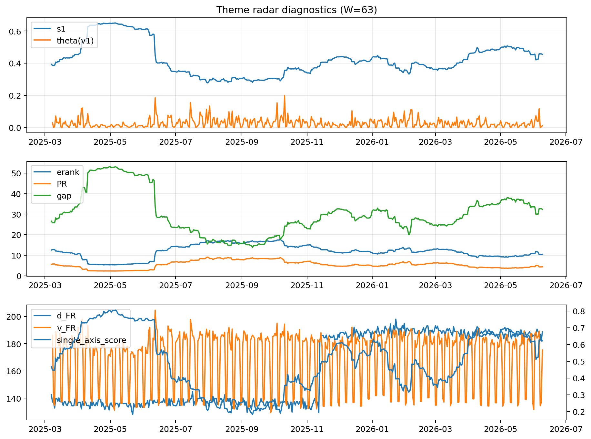

# Theme Radar Daily Brief — 2026-06-09

## Leaders (v1) — W=63
- **Nuclear_Uranium** (0.0806361405182342)
- Semis (0.0585251245283411)
- Metals (0.0550011791113833)

## Challengers — W=63
**v2:** Software_Cloud (0.1165401417764287), Cyber (0.0765668041054264), MegaCap_AI (0.0746801394209744)
**v3:** Genomics_Bio (0.1099467308949578), Semis (0.0985459886485144), Grid_Power (0.0689632640985929)

## Migration (20D slope) — W=63
**Top risers:**
- axis_Rates: 0.0008631432378559
- axis_Metals: 0.0006057344807092
- axis_Critical_Minerals: 0.0002786789202667
- axis_Nuclear_Uranium: 0.0002680658993449
- axis_Miners: 0.0002031717337205
- axis_Credit: 0.0001348849025317
- axis_Equity_US: 0.0001164580354268
- axis_Sector_Materials: 9.691957245723367e-05
- axis_USD: 8.717308801623021e-05
- axis_Clean_Broad: 7.7275741939911e-05

**Top fallers:**
- axis_Sector_ConsStap: -0.0001205849548956
- axis_Genomics_Bio: -0.0001258902670874
- axis_Sector_Comm: -0.0001368556849807
- axis_Cyber: -0.000166555962659
- axis_Commodities: -0.0001837915434459
- axis_Software_Cloud: -0.0002295625324547
- axis_Sector_Health: -0.0002389054226009
- axis_Semis: -0.0002722302896869
- axis_Crypto: -0.0003351568120319
- axis_MegaCap_AI: -0.0005332906515132

## Risk line (W=63)
- s1: 0.4546754969974507
- theta_v1: 0.0103896662325988
- v_FR: 175.41722514281915
- single_axis_score: 0.6226086956521739

## Interpretation
**Regime:** `theme_migration`

- Action: Tomorrow watchlist: Rates, Metals, Critical_Minerals, Nuclear_Uranium, Miners + v2_top1=Software_Cloud
- Action: Hedge note: normal correlation stability.

- Percentiles (W=63 history): vfr_pct=0.34, theta_pct=0.34, s1_pct=0.71, score_pct=0.70.

---
**BUNDLE_ROOT_SHA256:** `bd8981436c3228609fb85b32e20aa003da8d58e7f0b32a31f7cf28cbcd6f8dfd`
