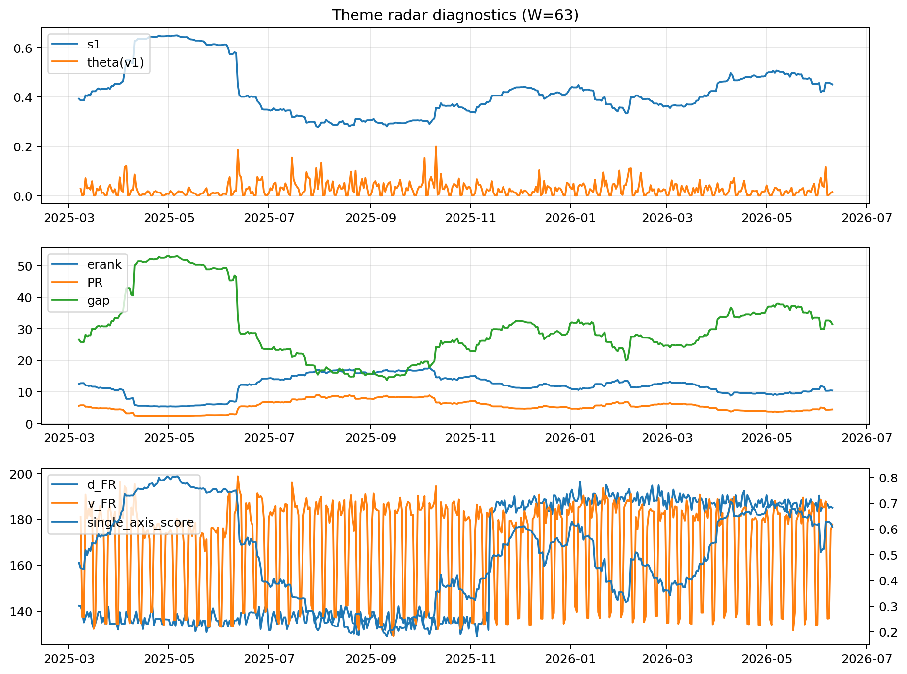

# Theme Radar Daily Brief — 2026-06-10

## Leaders (v1) — W=63
- **Nuclear_Uranium** (0.0811094211644028)
- Semis (0.0590945472502985)
- Metals (0.0550582639773431)

## Challengers — W=63
**v2:** Software_Cloud (0.1055614623071788), Cyber (0.069774546782133), MegaCap_AI (0.0651436915038845)
**v3:** Genomics_Bio (0.1084188670400022), Semis (0.0927647628742699), Grid_Power (0.0736060315885767)

## Migration (20D slope) — W=63
**Top risers:**
- axis_Rates: 0.0009147832434867
- axis_Metals: 0.0005923809732438
- axis_Critical_Minerals: 0.0002793724223078
- axis_Nuclear_Uranium: 0.0002444099532079
- axis_Miners: 0.0001891208379939
- axis_Quantum: 0.0001391219554074
- axis_Credit: 0.0001218960368483
- axis_Equity_US: 9.767100594158968e-05
- axis_Space: 8.413290517629298e-05
- axis_Clean_Broad: 8.304035284760147e-05

**Top fallers:**
- axis_Sector_RealEstate: -0.0001283320128368
- axis_Sector_Comm: -0.0001379393663527
- axis_Sector_Fin: -0.0001393253951755
- axis_Genomics_Bio: -0.0001555718373004
- axis_Software_Cloud: -0.0001763324652838
- axis_Crypto: -0.0002512627503781
- axis_Commodities: -0.0002539969501466
- axis_Sector_Health: -0.0002630625223797
- axis_Semis: -0.0002943627777835
- axis_MegaCap_AI: -0.0004855180322205

## Risk line (W=63)
- s1: 0.4512296936501459
- theta_v1: 0.0151097519348834
- v_FR: 177.7347033248479
- single_axis_score: 0.6086767895878525

## Interpretation
**Regime:** `theme_migration`

- Action: Tomorrow watchlist: Rates, Metals, Critical_Minerals, Nuclear_Uranium, Miners + v2_top1=Software_Cloud
- Action: Hedge note: normal correlation stability.

- Percentiles (W=63 history): vfr_pct=0.39, theta_pct=0.42, s1_pct=0.69, score_pct=0.67.

---
**BUNDLE_ROOT_SHA256:** `a38bf06638b3822753014ea52fd3c5e50d5cef0021c6c95652a605dd03864ab0`
