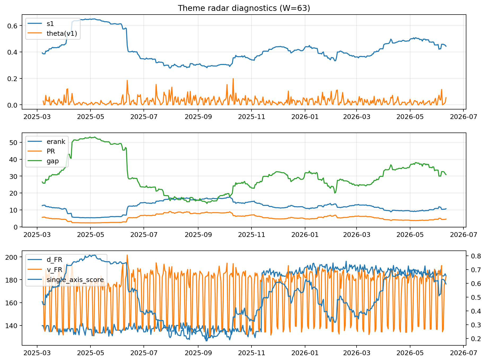

# Theme Radar Daily Brief — 2026-06-11

## Leaders (v1) — W=63
- **Nuclear_Uranium** (0.0809747202573046)
- Semis (0.0586333462788665)
- Metals (0.055024758674487)

## Challengers — W=63
**v2:** Software_Cloud (0.0989268990074139), Cyber (0.0672360640524011), MegaCap_AI (0.0626312056195751)
**v3:** Genomics_Bio (0.0989682117957412), Semis (0.088325628465749), Grid_Power (0.0793072520961751)

## Migration (20D slope) — W=63
**Top risers:**
- axis_Rates: 0.0009623174722684
- axis_Metals: 0.0005767951413005
- axis_Critical_Minerals: 0.0002751805478381
- axis_Nuclear_Uranium: 0.0002107949236806
- axis_Miners: 0.000179953961219
- axis_Quantum: 0.000165269153061
- axis_Space: 0.0001308493918085
- axis_Credit: 0.0001104278368831
- axis_Clean_Broad: 9.23518632743868e-05
- axis_Drones_Autonomy: 8.329229603822017e-05

**Top fallers:**
- axis_Crypto: -0.0001392722135971
- axis_Defense: -0.0001405412078485
- axis_Sector_Comm: -0.0001498341406937
- axis_Genomics_Bio: -0.0001630394579248
- axis_Sector_RealEstate: -0.0001715188745792
- axis_Sector_Fin: -0.0001841224242976
- axis_Sector_Health: -0.0002933584925312
- axis_Semis: -0.0003189786057827
- axis_Commodities: -0.0003451428863964
- axis_MegaCap_AI: -0.0004408030365325

## Risk line (W=63)
- s1: 0.443036754956694
- theta_v1: 0.0537807986620612
- v_FR: 182.63533944328825
- single_axis_score: 0.5948051948051949

## Interpretation
**Regime:** `theme_migration`

- Action: Tomorrow watchlist: Rates, Metals, Critical_Minerals, Nuclear_Uranium, Miners + v2_top1=Software_Cloud
- Action: Hedge note: normal correlation stability.

- Percentiles (W=63 history): vfr_pct=0.63, theta_pct=0.87, s1_pct=0.68, score_pct=0.65.

---
**BUNDLE_ROOT_SHA256:** `98a518b3cd3c07a4584d45bcfa4d24a693693cf269e0b1feac5df4f42ffa9b39`
