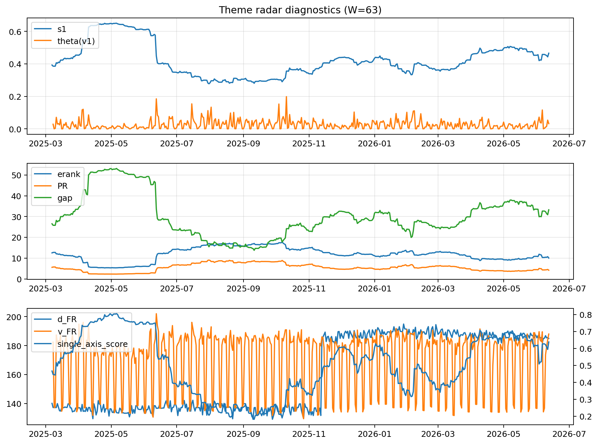

# Theme Radar Daily Brief — 2026-06-12

## Leaders (v1) — W=63
- **Nuclear_Uranium** (0.0797838854036502)
- Semis (0.0590428154486906)
- Metals (0.0550073688085893)

## Challengers — W=63
**v2:** Software_Cloud (0.104110642699505), Cyber (0.0692460965361268), MegaCap_AI (0.0628385189354563)
**v3:** Genomics_Bio (0.105865153569747), Semis (0.0873676823124313), Grid_Power (0.0764071960985394)

## Migration (20D slope) — W=63
**Top risers:**
- axis_Rates: 0.0009679201209647
- axis_Metals: 0.0005382110125206
- axis_Critical_Minerals: 0.0002702533293354
- axis_Space: 0.0001908038363328
- axis_Nuclear_Uranium: 0.0001753573210585
- axis_Quantum: 0.0001673087255738
- axis_Miners: 0.0001643691037978
- axis_Drones_Autonomy: 0.0001417298511067
- axis_Credit: 9.9505140706737e-05
- axis_Clean_Broad: 9.609465753702815e-05

**Top fallers:**
- axis_Defense: -0.0001581669603951
- axis_DataCenter_Infra: -0.0001651845031435
- axis_Sector_Energy: -0.0001704092128833
- axis_Genomics_Bio: -0.0001817529123594
- axis_Sector_Fin: -0.0002079522111858
- axis_Sector_RealEstate: -0.0002257342165197
- axis_Sector_Health: -0.000310829360105
- axis_Semis: -0.0003209084334775
- axis_Commodities: -0.0004032035684555
- axis_MegaCap_AI: -0.000413847696467

## Risk line (W=63)
- s1: 0.4655853350688665
- theta_v1: 0.0322208419575562
- v_FR: 187.9672465547917
- single_axis_score: 0.6380129589632829

## Interpretation
**Regime:** `theme_migration`

- Action: Tomorrow watchlist: Rates, Metals, Critical_Minerals, Space, Nuclear_Uranium + v2_top1=Software_Cloud
- Action: Hedge note: normal correlation stability.

- Percentiles (W=63 history): vfr_pct=0.89, theta_pct=0.69, s1_pct=0.74, score_pct=0.72.

---
**BUNDLE_ROOT_SHA256:** `f9026862ebb78702a0bcc760ec643d4a0d253544499ba00831cfdc388660dad9`
