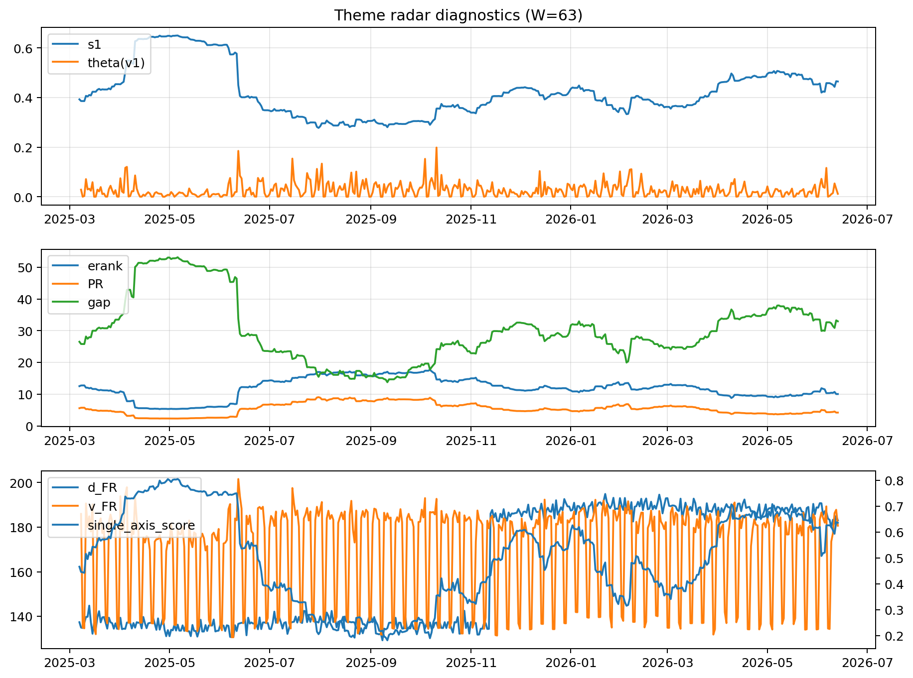

# Theme Radar Daily Brief — 2026-06-13

## Leaders (v1) — W=63
- **Nuclear_Uranium** (0.0797982604709705)
- Semis (0.0591511064875994)
- Metals (0.0553375282595763)

## Challengers — W=63
**v2:** Software_Cloud (0.1070862711749792), Cyber (0.0726210365407953), MegaCap_AI (0.0633739652359867)
**v3:** Genomics_Bio (0.108434092198646), Semis (0.0855108755679345), Grid_Power (0.0767438713599835)

## Migration (20D slope) — W=63
**Top risers:**
- axis_Rates: 0.0009544211849739
- axis_Metals: 0.0004906079812583
- axis_Critical_Minerals: 0.0002578103951869
- axis_Space: 0.0002227721881898
- axis_Drones_Autonomy: 0.0001906572237658
- axis_Quantum: 0.0001680383062245
- axis_Miners: 0.0001429257803225
- axis_Cyber: 0.0001397076638312
- axis_Nuclear_Uranium: 0.0001367237526014
- axis_Crypto: 0.0001346952539686

**Top fallers:**
- axis_Defense: -0.0001748067836815
- axis_Genomics_Bio: -0.0001936284201884
- axis_Sector_Energy: -0.0001999520804208
- axis_DataCenter_Infra: -0.0002056086576777
- axis_Sector_Fin: -0.0002242505255062
- axis_Sector_RealEstate: -0.0002728584526523
- axis_Semis: -0.0003153365093176
- axis_Sector_Health: -0.0003195376197894
- axis_MegaCap_AI: -0.0003753400105055
- axis_Commodities: -0.0004499401676906

## Risk line (W=63)
- s1: 0.4646318426910978
- theta_v1: 0.0119099424369694
- v_FR: 180.6455661698409
- single_axis_score: 0.6357758620689655

## Interpretation
**Regime:** `theme_migration`

- Action: Tomorrow watchlist: Rates, Metals, Critical_Minerals, Space, Drones_Autonomy + v2_top1=Software_Cloud
- Action: Hedge note: normal correlation stability.

- Percentiles (W=63 history): vfr_pct=0.49, theta_pct=0.38, s1_pct=0.74, score_pct=0.72.

---
**BUNDLE_ROOT_SHA256:** `4c2772765b3c72086135da3493ca1fff4534398192b5caba59e097b7d72085e6`
