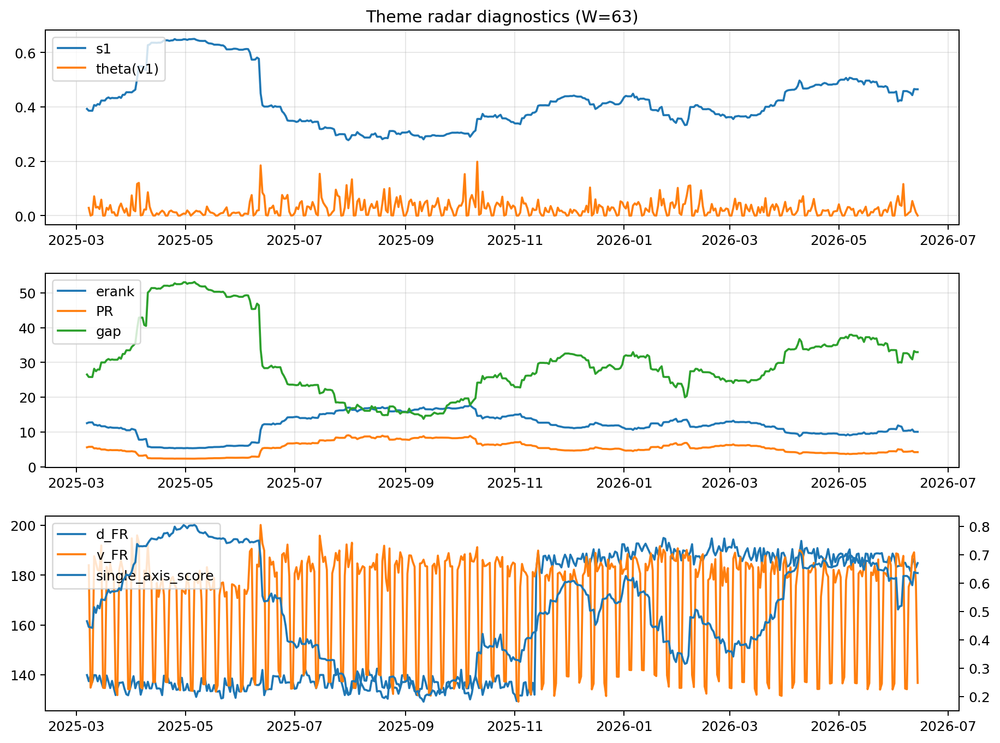

# Theme Radar Daily Brief — 2026-06-14

## Leaders (v1) — W=63
- **Nuclear_Uranium** (0.0797997758056054)
- Semis (0.0591523262891106)
- Metals (0.0553389952732027)

## Challengers — W=63
**v2:** Software_Cloud (0.1070832722125873), Cyber (0.0726197347328244), MegaCap_AI (0.0633731630691297)
**v3:** Genomics_Bio (0.1084408485635077), Semis (0.0855126920236426), Grid_Power (0.0767524149289923)

## Migration (20D slope) — W=63
**Top risers:**
- axis_Rates: 0.0009208839064027
- axis_Metals: 0.0004286859094936
- axis_Crypto: 0.0002694660538366
- axis_Space: 0.0002520459788407
- axis_Critical_Minerals: 0.0002395336342319
- axis_Drones_Autonomy: 0.0002349862490887
- axis_Cyber: 0.0002199737290211
- axis_Quantum: 0.0001677331802651
- axis_Miners: 0.0001180908191625
- axis_Software_Cloud: 0.0001101187657654

**Top fallers:**
- axis_Defense: -0.0001880707380835
- axis_Genomics_Bio: -0.0002025229765799
- axis_Sector_Energy: -0.0002256657869779
- axis_Sector_Fin: -0.0002345874249342
- axis_DataCenter_Infra: -0.0002413337412398
- axis_Semis: -0.0003039670926976
- axis_Sector_RealEstate: -0.0003124216980289
- axis_Sector_Health: -0.0003210070342373
- axis_MegaCap_AI: -0.0003257641338173
- axis_Commodities: -0.0004853859040982

## Risk line (W=63)
- s1: 0.4646257731643679
- theta_v1: 0.0004696721488969
- v_FR: 136.76700900067993
- single_axis_score: 0.6352688172043011

## Interpretation
**Regime:** `theme_migration`

- Action: Tomorrow watchlist: Rates, Metals, Crypto, Space, Critical_Minerals + v2_top1=Software_Cloud
- Action: Hedge note: normal correlation stability.

- Percentiles (W=63 history): vfr_pct=0.17, theta_pct=0.17, s1_pct=0.74, score_pct=0.72.

---
**BUNDLE_ROOT_SHA256:** `0ade4bbd132620884c13e39f787aa5478887ea00600c28a4d3143670c8a0313e`
