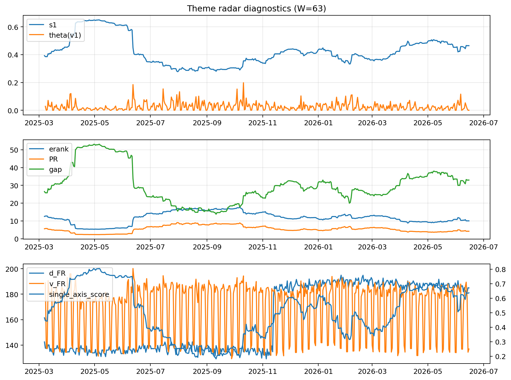

# Theme Radar Daily Brief — 2026-06-15

## Leaders (v1) — W=63
- **Nuclear_Uranium** (0.0798070426015328)
- Semis (0.0591435135205393)
- Metals (0.0553482908267192)

## Challengers — W=63
**v2:** Software_Cloud (0.1070897215798495), Cyber (0.0726023276500992), MegaCap_AI (0.0634061206537643)
**v3:** Genomics_Bio (0.1084277224239713), Semis (0.0856112002927008), Grid_Power (0.0767676083694874)

## Migration (20D slope) — W=63
**Top risers:**
- axis_Rates: 0.0008645621293212
- axis_Crypto: 0.0003875962990459
- axis_Metals: 0.0003852321088355
- axis_Cyber: 0.0002890587309808
- axis_Space: 0.0002786310734243
- axis_Drones_Autonomy: 0.0002715408838964
- axis_Critical_Minerals: 0.0002113784546534
- axis_Software_Cloud: 0.0001676471286799
- axis_Quantum: 0.0001640641313062
- axis_Sector_ConsStap: 0.0001292222643944

**Top fallers:**
- axis_Defense: -0.0001946048103723
- axis_Genomics_Bio: -0.0002089410975385
- axis_Sector_Energy: -0.0002383502754949
- axis_Sector_Fin: -0.0002413977058637
- axis_MegaCap_AI: -0.0002669821677873
- axis_DataCenter_Infra: -0.0002694436785594
- axis_Semis: -0.0002871708959121
- axis_Sector_Health: -0.0003124850685232
- axis_Sector_RealEstate: -0.0003454964279256
- axis_Commodities: -0.0005127898091247

## Risk line (W=63)
- s1: 0.4646336685357478
- theta_v1: 0.0002251804123484
- v_FR: 136.8803565257434
- single_axis_score: 0.6369098712446352

## Interpretation
**Regime:** `theme_migration`

- Action: Tomorrow watchlist: Rates, Crypto, Metals, Cyber, Space + v2_top1=Software_Cloud
- Action: Hedge note: normal correlation stability.

- Percentiles (W=63 history): vfr_pct=0.18, theta_pct=0.11, s1_pct=0.74, score_pct=0.72.

---
**BUNDLE_ROOT_SHA256:** `c6cd66f0e67f254fc61cb0e1769d719e3b012bac3bbc04b84493cbf7fbe3b163`
