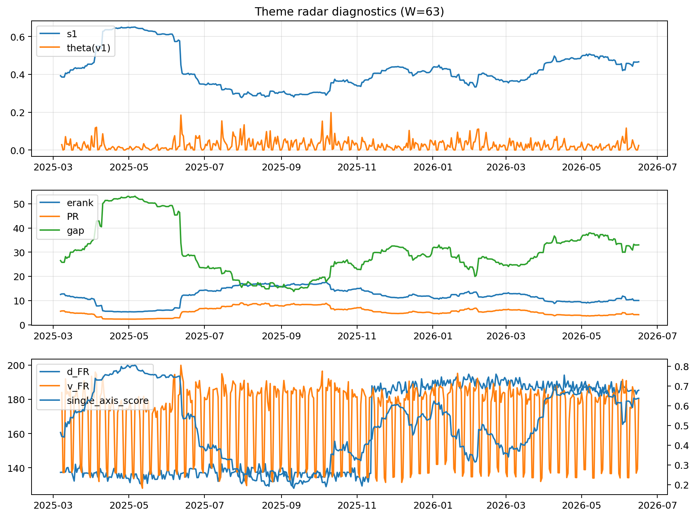

# Theme Radar Daily Brief — 2026-06-16

## Leaders (v1) — W=63
- **Nuclear_Uranium** (0.0799679500627953)
- Semis (0.0598543944926008)
- Metals (0.0560820953648761)

## Challengers — W=63
**v2:** Software_Cloud (0.1057751014399991), Cyber (0.0711606397600819), MegaCap_AI (0.0628188824590809)
**v3:** Genomics_Bio (0.1002280426060384), Grid_Power (0.0811440529167339), Semis (0.0783791442979619)

## Migration (20D slope) — W=63
**Top risers:**
- axis_Rates: 0.0007895655687671
- axis_Crypto: 0.0004846209223041
- axis_Metals: 0.0003447455795589
- axis_Cyber: 0.0003312223678835
- axis_Drones_Autonomy: 0.0002943201507694
- axis_Space: 0.0002908306458301
- axis_Software_Cloud: 0.0002076689244146
- axis_Critical_Minerals: 0.0001762834245214
- axis_Sector_ConsStap: 0.0001518892841765
- axis_Quantum: 0.0001448679375188

**Top fallers:**
- axis_MegaCap_AI: -0.000195814827582
- axis_Defense: -0.0002003938025283
- axis_Genomics_Bio: -0.0002029333834099
- axis_Sector_Energy: -0.0002334018342652
- axis_Semis: -0.0002492389897436
- axis_Sector_Fin: -0.0002507828784533
- axis_DataCenter_Infra: -0.0002958746387985
- axis_Sector_Health: -0.0003129653533924
- axis_Sector_RealEstate: -0.000381796871138
- axis_Commodities: -0.000504033869788

## Risk line (W=63)
- s1: 0.4664137141219591
- theta_v1: 0.0244712826814844
- v_FR: 179.7676958278524
- single_axis_score: 0.6372591006423983

## Interpretation
**Regime:** `theme_migration`

- Action: Tomorrow watchlist: Rates, Crypto, Metals, Cyber, Drones_Autonomy + v2_top1=Software_Cloud
- Action: Hedge note: normal correlation stability.

- Percentiles (W=63 history): vfr_pct=0.46, theta_pct=0.58, s1_pct=0.74, score_pct=0.72.

---
**BUNDLE_ROOT_SHA256:** `8c1eb267488e34999c8d17ee77fb9725679900c974ed67cca018b7eb0205d7cd`
