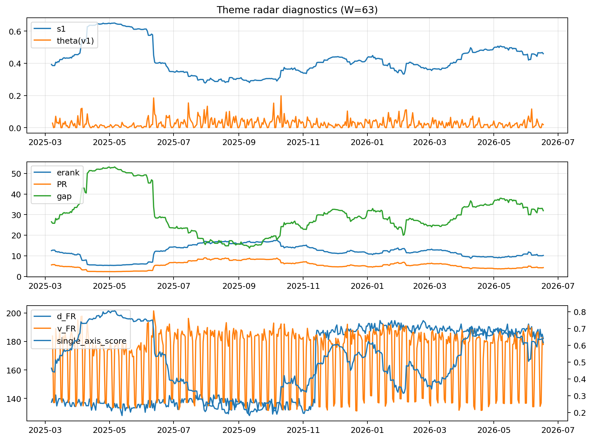

# Theme Radar Daily Brief — 2026-06-17

## Leaders (v1) — W=63
- **Nuclear_Uranium** (0.0803126750291409)
- Semis (0.0596316366066336)
- Metals (0.0559353252842329)

## Challengers — W=63
**v2:** Software_Cloud (0.097777093769207), Cyber (0.0662536551375775), MegaCap_AI (0.0602788293867454)
**v3:** Genomics_Bio (0.0948655178990474), Grid_Power (0.0811156517914391), Semis (0.077788306267954)

## Migration (20D slope) — W=63
**Top risers:**
- axis_Rates: 0.0006788119532832
- axis_Crypto: 0.0005832723277612
- axis_Cyber: 0.0003841371629973
- axis_Drones_Autonomy: 0.0003158427626659
- axis_Space: 0.0003008953091526
- axis_Metals: 0.0002885996057931
- axis_Software_Cloud: 0.0002587754566566
- axis_Sector_ConsStap: 0.000167289604323
- axis_Critical_Minerals: 0.0001527344955085
- axis_Quantum: 0.0001292755287713

**Top fallers:**
- axis_Sector_Utilities: -0.000161895472059
- axis_Defense: -0.0001970694693872
- axis_Genomics_Bio: -0.000200096698646
- axis_Semis: -0.0002026224514673
- axis_Sector_Energy: -0.0002296935032411
- axis_Sector_Fin: -0.0002599062604149
- axis_Sector_Health: -0.0003112056364767
- axis_DataCenter_Infra: -0.0003390802595828
- axis_Sector_RealEstate: -0.000411234580753
- axis_Commodities: -0.0005050086695347

## Risk line (W=63)
- s1: 0.4594695827130535
- theta_v1: 0.0191583542067079
- v_FR: 177.87311176901534
- single_axis_score: 0.6153846153846153

## Interpretation
**Regime:** `theme_migration`

- Action: Tomorrow watchlist: Rates, Crypto, Cyber, Drones_Autonomy, Space + v2_top1=Software_Cloud
- Action: Hedge note: normal correlation stability.

- Percentiles (W=63 history): vfr_pct=0.39, theta_pct=0.50, s1_pct=0.72, score_pct=0.69.

---
**BUNDLE_ROOT_SHA256:** `98e45df20ad1306f7533bf5b86e7fb62f0b0bedf44adc2a30d76a6403c2b01ec`
