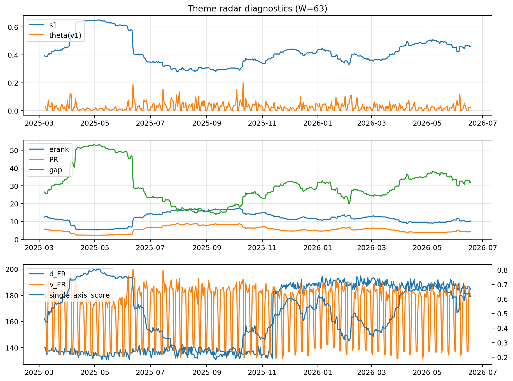

# Theme Radar Daily Brief — 2026-06-18

## Leaders (v1) — W=63
- **Nuclear_Uranium** (0.0801079890026592)
- Semis (0.0586781984652547)
- Metals (0.0561768424971192)

## Challengers — W=63
**v2:** Software_Cloud (0.0930962768994941), Cyber (0.0651959749319924), Semis (0.0638753436686983)
**v3:** Software_Cloud (0.0795688477326996), Grid_Power (0.0770144681890375), MegaCap_AI (0.0705325772951717)

## Migration (20D slope) — W=63
**Top risers:**
- axis_Crypto: 0.000641416328905
- axis_Rates: 0.0005063885535456
- axis_Cyber: 0.0004407015650329
- axis_Drones_Autonomy: 0.0003209897592827
- axis_Software_Cloud: 0.0003068825961554
- axis_Space: 0.0002819590040404
- axis_Metals: 0.0002050099252433
- axis_Sector_ConsStap: 0.0001571717451258
- axis_Quantum: 0.0001441942254158
- axis_Critical_Minerals: 0.0001224058661584

**Top fallers:**
- axis_Genomics_Bio: -0.0001599469667475
- axis_Semis: -0.0001679332127255
- axis_Sector_Utilities: -0.0001699405450385
- axis_Defense: -0.0001990265221442
- axis_Sector_Energy: -0.0002260600282564
- axis_Sector_Fin: -0.0002601820448322
- axis_Sector_Health: -0.0002899840649016
- axis_DataCenter_Infra: -0.0003720436408892
- axis_Sector_RealEstate: -0.0004187486934629
- axis_Commodities: -0.0004946682511644

## Risk line (W=63)
- s1: 0.4574240889943201
- theta_v1: 0.0254566011279625
- v_FR: 181.0065893657141
- single_axis_score: 0.6208955223880597

## Interpretation
**Regime:** `theme_migration`

- Action: Tomorrow watchlist: Crypto, Rates, Cyber, Drones_Autonomy, Software_Cloud + v2_top1=Software_Cloud
- Action: Hedge note: normal correlation stability.

- Percentiles (W=63 history): vfr_pct=0.50, theta_pct=0.59, s1_pct=0.71, score_pct=0.70.

---
**BUNDLE_ROOT_SHA256:** `5a223713ee3c4e38c3c62e553df11c852b8ed705852706e57829fa083dddced9`
