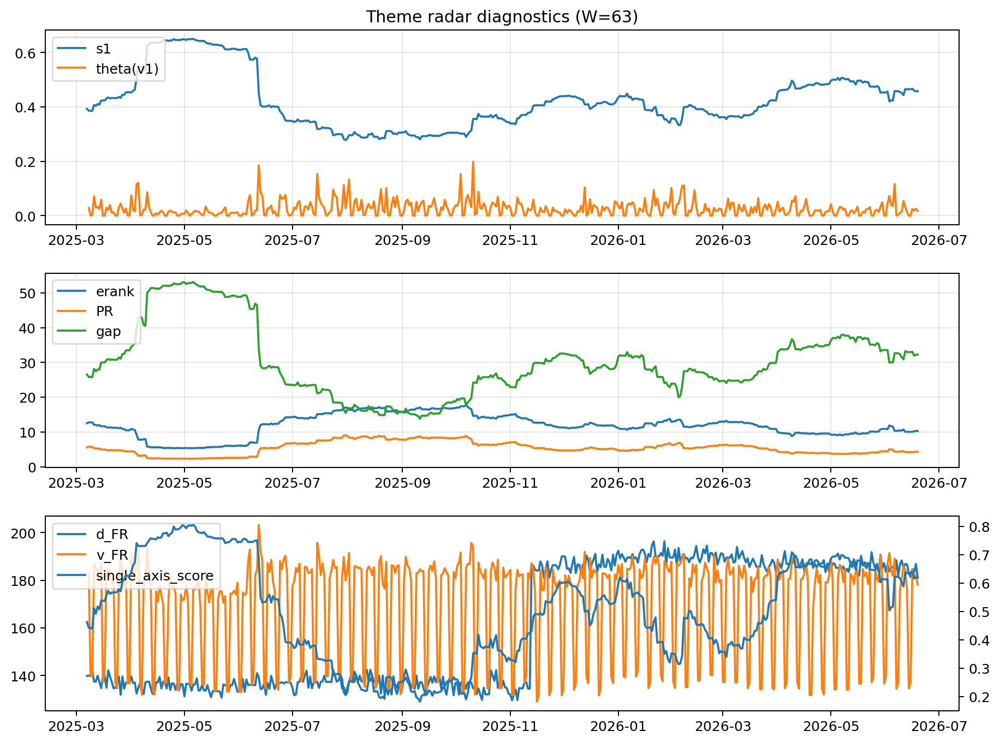

# Theme Radar Daily Brief — 2026-06-19

## Leaders (v1) — W=63
- **Nuclear_Uranium** (0.0803056384434302)
- Semis (0.0592482209310902)
- Metals (0.0551758690375966)

## Challengers — W=63
**v2:** Software_Cloud (0.0922577672073693), Semis (0.0688912630050551), Cyber (0.0646736163632501)
**v3:** Software_Cloud (0.0815461406194642), Semis (0.0755304940544482), Grid_Power (0.0753121067175717)

## Migration (20D slope) — W=63
**Top risers:**
- axis_Crypto: 0.0006299554059764
- axis_Cyber: 0.0004499153585342
- axis_Rates: 0.0003573856130914
- axis_Software_Cloud: 0.0003226123805407
- axis_Drones_Autonomy: 0.0003055701036805
- axis_Space: 0.0002550767978506
- axis_Metals: 0.0001767580129753
- axis_Sector_ConsStap: 0.000154775156656
- axis_Quantum: 0.0001455863451839
- axis_Critical_Minerals: 0.0001170900372203

**Top fallers:**
- axis_Genomics_Bio: -0.0001182605759558
- axis_Semis: -0.0001239799249213
- axis_Sector_Utilities: -0.000166227100164
- axis_Defense: -0.0002000571515089
- axis_Sector_Energy: -0.0002169828001841
- axis_Sector_Fin: -0.0002656271691514
- axis_Sector_Health: -0.0002711334734959
- axis_DataCenter_Infra: -0.0003723008761355
- axis_Sector_RealEstate: -0.0004202958714703
- axis_Commodities: -0.0004801497486884

## Risk line (W=63)
- s1: 0.4576585063809612
- theta_v1: 0.017956254299077
- v_FR: 178.13300119743406
- single_axis_score: 0.6187234042553191

## Interpretation
**Regime:** `theme_migration`

- Action: Tomorrow watchlist: Crypto, Cyber, Rates, Software_Cloud, Drones_Autonomy + v2_top1=Software_Cloud
- Action: Hedge note: normal correlation stability.

- Percentiles (W=63 history): vfr_pct=0.39, theta_pct=0.47, s1_pct=0.71, score_pct=0.69.

---
**BUNDLE_ROOT_SHA256:** `8aebb496e97e0db3480510b54d268a4257451c017d0c4fb0aee76a6e7f27096c`
