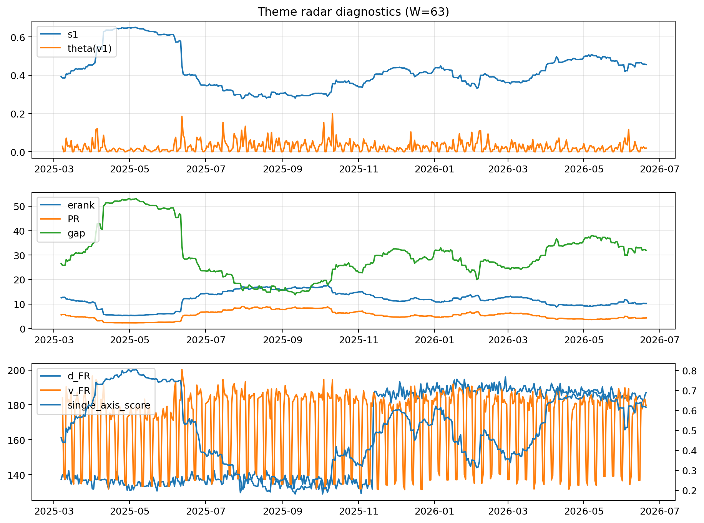

# Theme Radar Daily Brief — 2026-06-20

## Leaders (v1) — W=63
- **Nuclear_Uranium** (0.0806748962966486)
- Semis (0.0592960755627207)
- Metals (0.0551866171844389)

## Challengers — W=63
**v2:** Software_Cloud (0.0925145145823891), Semis (0.0684710308266681), Cyber (0.0646113741053163)
**v3:** Software_Cloud (0.080414908142105), Grid_Power (0.0787379714254489), Semis (0.0785336915568045)

## Migration (20D slope) — W=63
**Top risers:**
- axis_Crypto: 0.0005932622535853
- axis_Cyber: 0.0004499138152343
- axis_Software_Cloud: 0.0003324160593852
- axis_Drones_Autonomy: 0.0003044449275437
- axis_Space: 0.0002372265393766
- axis_Rates: 0.0001880979815566
- axis_Sector_ConsStap: 0.0001602485728389
- axis_Quantum: 0.0001462134719674
- axis_Metals: 0.0001440711255242
- axis_Critical_Minerals: 0.0001163873572584

**Top fallers:**
- axis_Sector_Comm: -9.65451571918834e-05
- axis_USD: -0.0001077620337546
- axis_Sector_Utilities: -0.00015826390022
- axis_Defense: -0.0001959296151997
- axis_Sector_Energy: -0.000209095868599
- axis_Sector_Health: -0.0002525739073638
- axis_Sector_Fin: -0.000268457665851
- axis_DataCenter_Infra: -0.0003737128236408
- axis_Sector_RealEstate: -0.0004196854350109
- axis_Commodities: -0.0004678298109519

## Risk line (W=63)
- s1: 0.4559094336904377
- theta_v1: 0.0191992955335484
- v_FR: 179.49902646741128
- single_axis_score: 0.6161358811040339

## Interpretation
**Regime:** `theme_migration`

- Action: Tomorrow watchlist: Crypto, Cyber, Software_Cloud, Drones_Autonomy, Space + v2_top1=Software_Cloud
- Action: Hedge note: normal correlation stability.

- Percentiles (W=63 history): vfr_pct=0.43, theta_pct=0.50, s1_pct=0.70, score_pct=0.69.

---
**BUNDLE_ROOT_SHA256:** `3a87587269606bad9429d28ebbeaaca4c7156621f33043254dc88da711aca36e`
