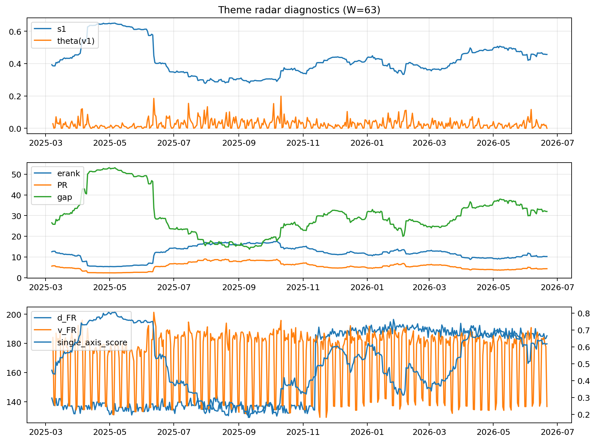

# Theme Radar Daily Brief — 2026-06-21

## Leaders (v1) — W=63
- **Nuclear_Uranium** (0.0805446631612357)
- Semis (0.0592099078058526)
- Metals (0.0551277739137329)

## Challengers — W=63
**v2:** Software_Cloud (0.0927098694586435), Semis (0.0681146867737482), Cyber (0.0646451859043849)
**v3:** Software_Cloud (0.0795082913930696), Semis (0.0788405271818116), Grid_Power (0.0782159542301741)

## Migration (20D slope) — W=63
**Top risers:**
- axis_Crypto: 0.0005943933934179
- axis_Cyber: 0.0004410097308232
- axis_Software_Cloud: 0.000337899805199
- axis_Drones_Autonomy: 0.0002940309242314
- axis_Space: 0.0002074222382397
- axis_Sector_ConsStap: 0.0001614266036284
- axis_Quantum: 0.000137803963079
- axis_Clean_Broad: 0.000109031241506
- axis_Critical_Minerals: 0.0001075828294902
- axis_Metals: 0.0001043451625827

**Top fallers:**
- axis_Sector_Materials: -8.395314682823926e-05
- axis_USD: -0.0001227756741205
- axis_Sector_Utilities: -0.0001488394845688
- axis_Defense: -0.0001891585156317
- axis_Sector_Energy: -0.0001971656043275
- axis_Sector_Health: -0.0002261672199868
- axis_Sector_Fin: -0.0002646464464674
- axis_DataCenter_Infra: -0.000367485058211
- axis_Sector_RealEstate: -0.0004090513030306
- axis_Commodities: -0.0004460132586386

## Risk line (W=63)
- s1: 0.4564714233142615
- theta_v1: 8.166804310766095e-05
- v_FR: 136.666683279167
- single_axis_score: 0.6177966101694915

## Interpretation
**Regime:** `theme_migration`

- Action: Tomorrow watchlist: Crypto, Cyber, Software_Cloud, Drones_Autonomy, Space + v2_top1=Software_Cloud
- Action: Hedge note: normal correlation stability.

- Percentiles (W=63 history): vfr_pct=0.13, theta_pct=0.05, s1_pct=0.71, score_pct=0.69.

---
**BUNDLE_ROOT_SHA256:** `809a9d7bedbdeb9b92fcf4d3773bbb8c636ba34cd0258b527399f1837deb8377`
