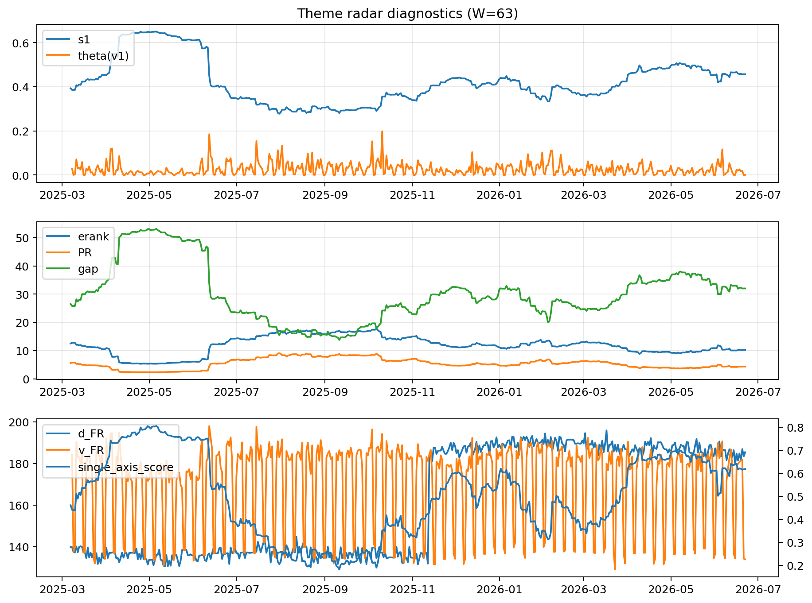

# Theme Radar Daily Brief — 2026-06-22

## Leaders (v1) — W=63
- **Nuclear_Uranium** (0.0805341815810481)
- Semis (0.0591992638416613)
- Metals (0.0551245226506449)

## Challengers — W=63
**v2:** Software_Cloud (0.0927353964191868), Semis (0.0680612348751999), Cyber (0.0646479481161124)
**v3:** Software_Cloud (0.0794172448152699), Semis (0.0789423120456955), Grid_Power (0.0781792943754938)

## Migration (20D slope) — W=63
**Top risers:**
- axis_Crypto: 0.0005634760546395
- axis_Cyber: 0.0003974094420317
- axis_Software_Cloud: 0.0003117709768997
- axis_Drones_Autonomy: 0.0002695975693493
- axis_Sector_ConsStap: 0.0001664274865142
- axis_Space: 0.0001648284970266
- axis_MegaCap_AI: 0.0001209195201269
- axis_Quantum: 0.0001137437304918
- axis_Clean_Broad: 0.0001053485497408
- axis_Critical_Minerals: 9.149244658303414e-05

**Top fallers:**
- axis_Rates: -0.0001017253488235
- axis_Sector_Utilities: -0.0001258081393495
- axis_USD: -0.0001346267968076
- axis_Sector_Energy: -0.0001741242681715
- axis_Defense: -0.0001750996793443
- axis_Sector_Health: -0.0001862335557072
- axis_Sector_Fin: -0.0002434978660379
- axis_DataCenter_Infra: -0.000354205980269
- axis_Sector_RealEstate: -0.0003839359763277
- axis_Commodities: -0.0004106257976446

## Risk line (W=63)
- s1: 0.456533883085037
- theta_v1: 0.0007798421190629
- v_FR: 133.99189905614256
- single_axis_score: 0.6181818181818183

## Interpretation
**Regime:** `theme_migration`

- Action: Tomorrow watchlist: Crypto, Cyber, Software_Cloud, Drones_Autonomy, Sector_ConsStap + v2_top1=Software_Cloud
- Action: Hedge note: normal correlation stability.

- Percentiles (W=63 history): vfr_pct=0.04, theta_pct=0.19, s1_pct=0.71, score_pct=0.69.

---
**BUNDLE_ROOT_SHA256:** `41be1617e15409c118c133747166337b0577fb204126ab6b0ad50cea9cfd74e9`
