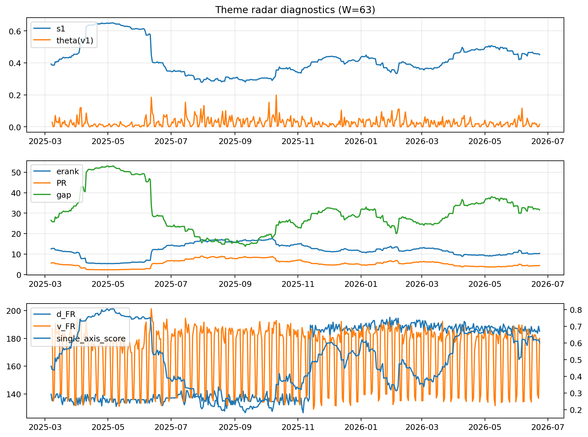

# Theme Radar Daily Brief — 2026-06-23

## Leaders (v1) — W=63
- **Nuclear_Uranium** (0.0811608101465871)
- Semis (0.0596006539053113)
- Metals (0.0556259269947243)

## Challengers — W=63
**v2:** Software_Cloud (0.0991118673688109), Cyber (0.0683407941333632), Semis (0.0653298215685081)
**v3:** Grid_Power (0.0787635362333035), Semis (0.0766946074541631), MegaCap_AI (0.0689013731663926)

## Migration (20D slope) — W=63
**Top risers:**
- axis_Crypto: 0.0004367416968783
- axis_Cyber: 0.0003714367336135
- axis_Software_Cloud: 0.0002796438298878
- axis_Drones_Autonomy: 0.0002149047848705
- axis_Sector_ConsStap: 0.0001721862620191
- axis_Space: 0.0001132023381275
- axis_Quantum: 0.0001008451988669
- axis_Critical_Minerals: 9.77285007704971e-05
- axis_Grid_Power: 9.580305579091124e-05
- axis_Clean_Broad: 9.39220404284415e-05

**Top fallers:**
- axis_Sector_Utilities: -8.590457461562297e-05
- axis_Rates: -0.0001342213544882
- axis_Sector_Energy: -0.0001356561943057
- axis_USD: -0.000138826311794
- axis_Defense: -0.0001511100552292
- axis_Sector_Health: -0.0001576463499705
- axis_Sector_Fin: -0.0002313394805702
- axis_Commodities: -0.0003379551938246
- axis_DataCenter_Infra: -0.000347513968057
- axis_Sector_RealEstate: -0.0003496231884505

## Risk line (W=63)
- s1: 0.451121763940921
- theta_v1: 0.0154598310607796
- v_FR: 179.94586068242734
- single_axis_score: 0.6021097046413502

## Interpretation
**Regime:** `theme_migration`

- Action: Tomorrow watchlist: Crypto, Cyber, Software_Cloud, Drones_Autonomy, Sector_ConsStap + v2_top1=Software_Cloud
- Action: Hedge note: normal correlation stability.

- Percentiles (W=63 history): vfr_pct=0.46, theta_pct=0.43, s1_pct=0.68, score_pct=0.66.

---
**BUNDLE_ROOT_SHA256:** `e94d542a60894a9157a3da8ad1ebf085388648a3e810e74f08812edaaac4af05`
