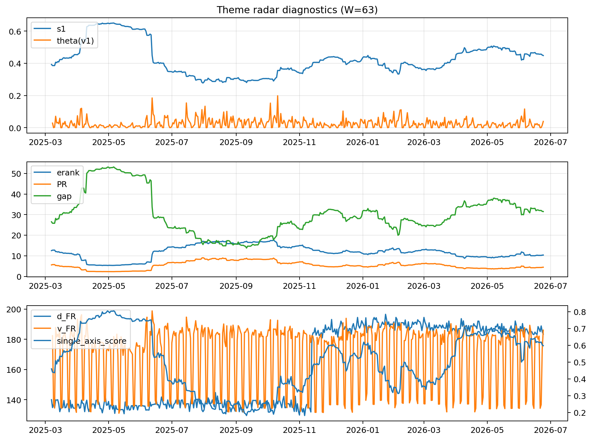

# Theme Radar Daily Brief — 2026-06-24

## Leaders (v1) — W=63
- **Nuclear_Uranium** (0.079718037975057)
- Semis (0.0617323429249485)
- Metals (0.0559217163838157)

## Challengers — W=63
**v2:** Software_Cloud (0.0905257106309853), Semis (0.0649460126213284), DataCenter_Infra (0.0628025922566963)
**v3:** Grid_Power (0.0830593744388647), Software_Cloud (0.0760719129821597), Semis (0.07375231651368)

## Migration (20D slope) — W=63
**Top risers:**
- axis_Crypto: 0.0003510866354065
- axis_Cyber: 0.0003067904109658
- axis_Software_Cloud: 0.0002352331437854
- axis_Sector_ConsStap: 0.0001914304671
- axis_Drones_Autonomy: 0.0001870109128024
- axis_Grid_Power: 0.0001306887632939
- axis_Critical_Minerals: 0.000119163550251
- axis_Quantum: 0.0001032638854717
- axis_Clean_Broad: 9.314692680385823e-05
- axis_Semis: 9.259127721627346e-05

**Top fallers:**
- axis_Sector_Comm: -8.626638203256459e-05
- axis_Sector_Energy: -9.027306059361684e-05
- axis_Defense: -0.0001283851315953
- axis_USD: -0.000139864731692
- axis_Sector_Health: -0.000154523795252
- axis_Rates: -0.0001842412973359
- axis_Sector_Fin: -0.0002137636950467
- axis_Commodities: -0.0002811874280898
- axis_Sector_RealEstate: -0.000332664447262
- axis_DataCenter_Infra: -0.0003371026946044

## Risk line (W=63)
- s1: 0.4480875791813563
- theta_v1: 0.0391426972163491
- v_FR: 186.0604879126872
- single_axis_score: 0.5974736842105263

## Interpretation
**Regime:** `theme_migration`

- Action: Tomorrow watchlist: Crypto, Cyber, Software_Cloud, Sector_ConsStap, Drones_Autonomy + v2_top1=Software_Cloud
- Action: Hedge note: normal correlation stability.

- Percentiles (W=63 history): vfr_pct=0.82, theta_pct=0.77, s1_pct=0.67, score_pct=0.64.

---
**BUNDLE_ROOT_SHA256:** `3ff608fe71ba9d60126f3ab4eaeef4b968c38d7a2ce747546605716340628e05`
