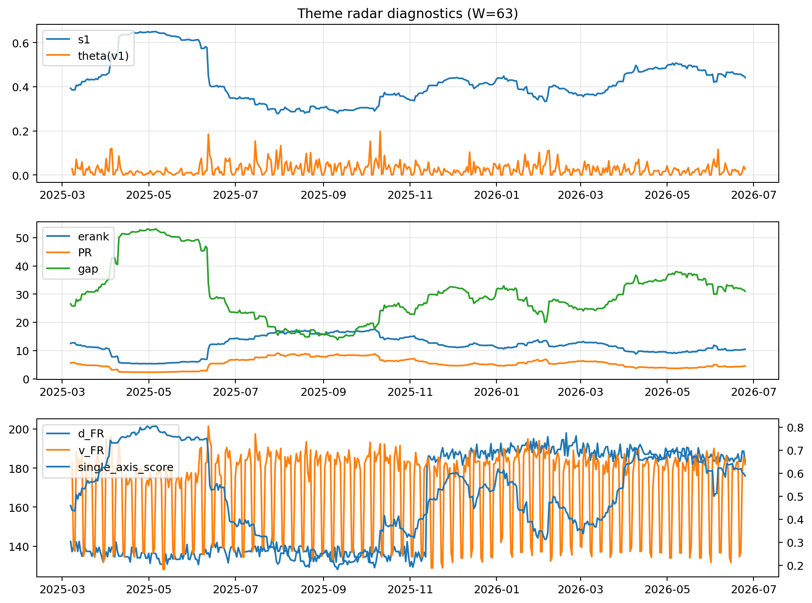

# Theme Radar Daily Brief — 2026-06-25

## Leaders (v1) — W=63
- **Nuclear_Uranium** (0.0810292773918152)
- Semis (0.0621872226850517)
- Metals (0.054887605006199)

## Challengers — W=63
**v2:** Software_Cloud (0.0891722899965432), Semis (0.0649216732548596), DataCenter_Infra (0.0613381358932937)
**v3:** Grid_Power (0.0817660780385589), Software_Cloud (0.0785736657017538), MegaCap_AI (0.0729707589620226)

## Migration (20D slope) — W=63
**Top risers:**
- axis_Crypto: 0.0002347305979122
- axis_Cyber: 0.0002296957272189
- axis_Sector_ConsStap: 0.0002118814089421
- axis_Software_Cloud: 0.0001706131492186
- axis_Grid_Power: 0.0001699757255537
- axis_Drones_Autonomy: 0.0001579817443295
- axis_Critical_Minerals: 0.000126291959975
- axis_Quantum: 0.0001017352794534
- axis_Clean_Broad: 8.867528703196314e-05
- axis_Semis: 8.42249014438289e-05

**Top fallers:**
- axis_Defense: -8.062257147100415e-05
- axis_Sector_Comm: -9.884601522010137e-05
- axis_USD: -0.0001298338360995
- axis_Sector_Health: -0.0001472339005927
- axis_Genomics_Bio: -0.0001728090177365
- axis_Commodities: -0.0001893770963079
- axis_Sector_Fin: -0.0001904905965294
- axis_Rates: -0.0002499968523346
- axis_Sector_RealEstate: -0.0002920950924871
- axis_DataCenter_Infra: -0.0003096090814125

## Risk line (W=63)
- s1: 0.4417199426735593
- theta_v1: 0.0262713462732472
- v_FR: 181.89823271583631
- single_axis_score: 0.5882352941176471

## Interpretation
**Regime:** `theme_migration`

- Action: Tomorrow watchlist: Crypto, Cyber, Sector_ConsStap, Software_Cloud, Grid_Power + v2_top1=Software_Cloud
- Action: Hedge note: normal correlation stability.

- Percentiles (W=63 history): vfr_pct=0.57, theta_pct=0.61, s1_pct=0.66, score_pct=0.64.

---
**BUNDLE_ROOT_SHA256:** `7f02c17e736aa32521dc853c7b63887355639798d2b65b9ef2f9f9f4f900edd9`
