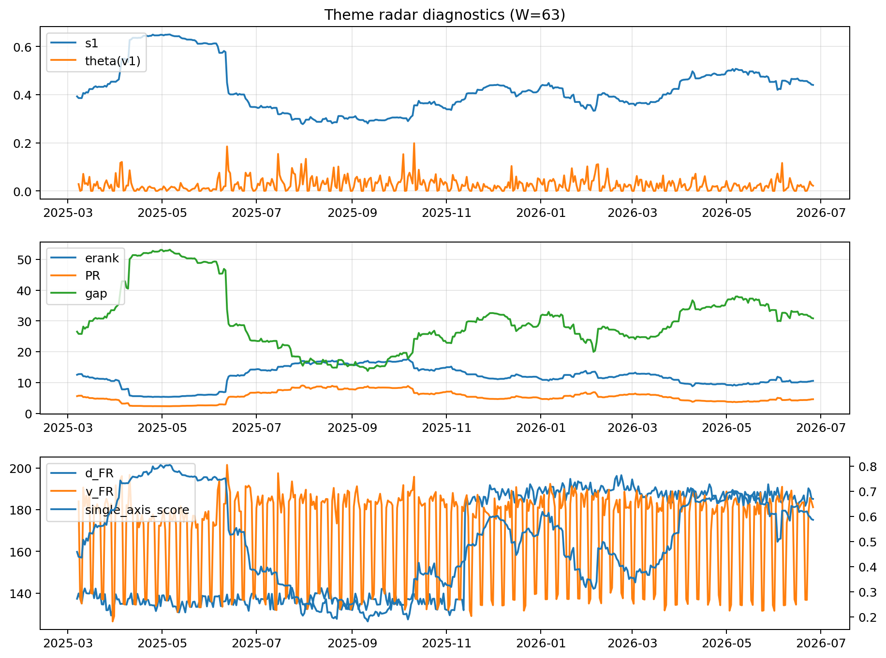

# Theme Radar Daily Brief — 2026-06-26

## Leaders (v1) — W=63
- **Nuclear_Uranium** (0.0820016007640182)
- Semis (0.0622684947365017)
- Metals (0.0549390905115235)

## Challengers — W=63
**v2:** Software_Cloud (0.083851130619935), Semis (0.0681477381553533), DataCenter_Infra (0.0592404855444815)
**v3:** MegaCap_AI (0.0912168929268318), Software_Cloud (0.0841926855313526), Grid_Power (0.0818634225799944)

## Migration (20D slope) — W=63
**Top risers:**
- axis_Crypto: 0.0002014337016233
- axis_Sector_ConsStap: 0.0001994169929067
- axis_Cyber: 0.0001993706811535
- axis_Grid_Power: 0.0001975267496009
- axis_Drones_Autonomy: 0.0001535995323626
- axis_Critical_Minerals: 0.0001481548231832
- axis_Software_Cloud: 0.0001321239495863
- axis_Semis: 0.0001229261695678
- axis_Quantum: 0.0001191523421227
- axis_Clean_Broad: 0.0001079651039209

**Top fallers:**
- axis_Defense: -6.830405485490456e-05
- axis_Sector_Comm: -0.0001074347653969
- axis_USD: -0.0001250096524495
- axis_Sector_Health: -0.0001612576610161
- axis_Sector_Fin: -0.000187126373249
- axis_Commodities: -0.0002041429646277
- axis_Genomics_Bio: -0.0002049104739051
- axis_Sector_RealEstate: -0.000278507712566
- axis_DataCenter_Infra: -0.0002859545980508
- axis_Rates: -0.0003244389454575

## Risk line (W=63)
- s1: 0.4402811550422892
- theta_v1: 0.0218451959988674
- v_FR: 181.1783596574057
- single_axis_score: 0.5861635220125786

## Interpretation
**Regime:** `theme_migration`

- Action: Tomorrow watchlist: Crypto, Sector_ConsStap, Cyber, Grid_Power, Drones_Autonomy + v2_top1=Software_Cloud
- Action: Hedge note: normal correlation stability.

- Percentiles (W=63 history): vfr_pct=0.53, theta_pct=0.55, s1_pct=0.66, score_pct=0.64.

---
**BUNDLE_ROOT_SHA256:** `4ae4a22390360d6ab0e7385cf1856185b94ae33fe7159cc7eb238c88f051de99`
