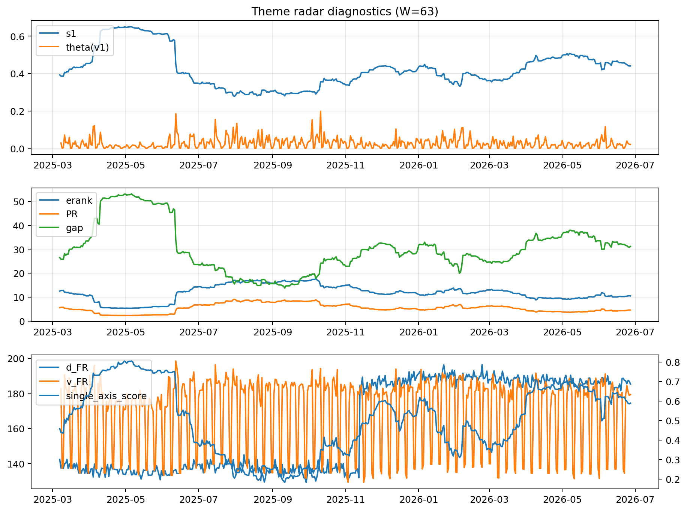

# Theme Radar Daily Brief — 2026-06-27

## Leaders (v1) — W=63
- **Nuclear_Uranium** (0.0826102534021366)
- Semis (0.0623811551302083)
- Metals (0.0543091535490501)

## Challengers — W=63
**v2:** Semis (0.0764012067989755), DataCenter_Infra (0.0624470831231218), Software_Cloud (0.0557895141947763)
**v3:** Software_Cloud (0.1108434361114993), MegaCap_AI (0.0994747706730432), Grid_Power (0.0910737499227381)

## Migration (20D slope) — W=63
**Top risers:**
- axis_Grid_Power: 0.0002096186510497
- axis_Sector_ConsStap: 0.0001798753431376
- axis_Critical_Minerals: 0.0001627074175337
- axis_Cyber: 0.0001590382011051
- axis_Semis: 0.0001588769875956
- axis_Crypto: 0.0001580625820036
- axis_Drones_Autonomy: 0.0001487048379682
- axis_Quantum: 0.0001344708536714
- axis_Space: 0.0001158929775647
- axis_Clean_Broad: 0.000113661583269

**Top fallers:**
- axis_MegaCap_AI: -7.870747938757426e-05
- axis_Sector_Comm: -0.0001091239756458
- axis_USD: -0.0001178532047722
- axis_Sector_Health: -0.0001727051253504
- axis_Sector_Fin: -0.0001771955529829
- axis_Genomics_Bio: -0.0001899561840129
- axis_Commodities: -0.0002149769258825
- axis_Sector_RealEstate: -0.0002590616156818
- axis_DataCenter_Infra: -0.0002607957585681
- axis_Rates: -0.0003943272252402

## Risk line (W=63)
- s1: 0.4403899377949751
- theta_v1: 0.0211243101557537
- v_FR: 179.26890894228248
- single_axis_score: 0.5887029288702929

## Interpretation
**Regime:** `theme_migration`

- Action: Tomorrow watchlist: Grid_Power, Sector_ConsStap, Critical_Minerals, Cyber, Semis + v2_top1=Semis
- Action: Hedge note: normal correlation stability.

- Percentiles (W=63 history): vfr_pct=0.44, theta_pct=0.54, s1_pct=0.66, score_pct=0.64.

---
**BUNDLE_ROOT_SHA256:** `b7ed9df0177018b5dc6e3652e3adf53c4115bbddf52cb2fdfe7f551ef4679c06`
