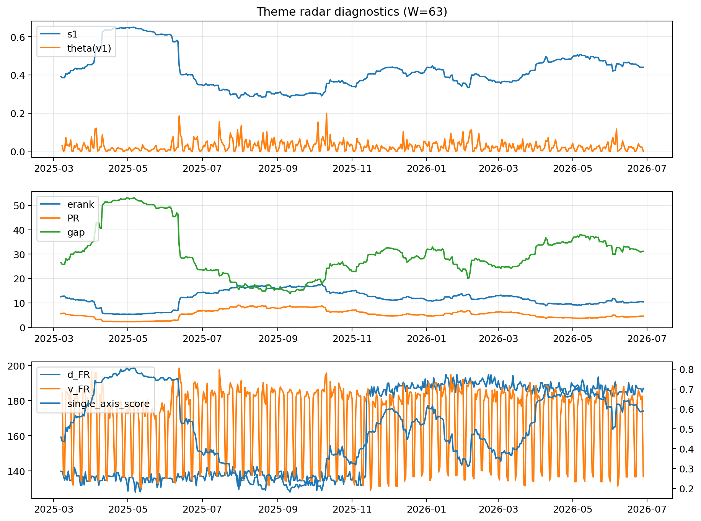

# Theme Radar Daily Brief — 2026-06-28

## Leaders (v1) — W=63
- **Nuclear_Uranium** (0.0826087096872586)
- Semis (0.0623808555080491)
- Metals (0.0543081520054607)

## Challengers — W=63
**v2:** Semis (0.076400156814036), DataCenter_Infra (0.0624473323537289), Software_Cloud (0.055794427347986)
**v3:** Software_Cloud (0.110840715349112), MegaCap_AI (0.099468505173443), Grid_Power (0.0910705738464557)

## Migration (20D slope) — W=63
**Top risers:**
- axis_Grid_Power: 0.0002163516070487
- axis_Semis: 0.0001906595996016
- axis_Critical_Minerals: 0.000173692729944
- axis_Sector_ConsStap: 0.0001530100580055
- axis_Quantum: 0.0001480528759969
- axis_Drones_Autonomy: 0.00013844103505
- axis_Space: 0.0001382255751837
- axis_Clean_Broad: 0.0001168048788361
- axis_Cyber: 0.000114162898494
- axis_Crypto: 0.0001025068229672

**Top fallers:**
- axis_Sector_Comm: -0.0001074577242261
- axis_USD: -0.0001080079669294
- axis_MegaCap_AI: -0.0001127274644248
- axis_Sector_Fin: -0.0001621066704653
- axis_Genomics_Bio: -0.0001730762059436
- axis_Sector_Health: -0.0001787412789817
- axis_Commodities: -0.000217481320425
- axis_DataCenter_Infra: -0.0002292116131443
- axis_Sector_RealEstate: -0.0002312818315036
- axis_Rates: -0.0004522619696035

## Risk line (W=63)
- s1: 0.4403941892974738
- theta_v1: 5.1859256599795454e-05
- v_FR: 136.9563116368072
- single_axis_score: 0.5887265135699373

## Interpretation
**Regime:** `theme_migration`

- Action: Tomorrow watchlist: Grid_Power, Semis, Critical_Minerals, Sector_ConsStap, Quantum + v2_top1=Semis
- Action: Hedge note: normal correlation stability.

- Percentiles (W=63 history): vfr_pct=0.18, theta_pct=0.03, s1_pct=0.66, score_pct=0.64.

---
**BUNDLE_ROOT_SHA256:** `f4bc445119cabce4a141674e77765d3fdad882d6d1b64e4659fe1710c58e4d6a`
