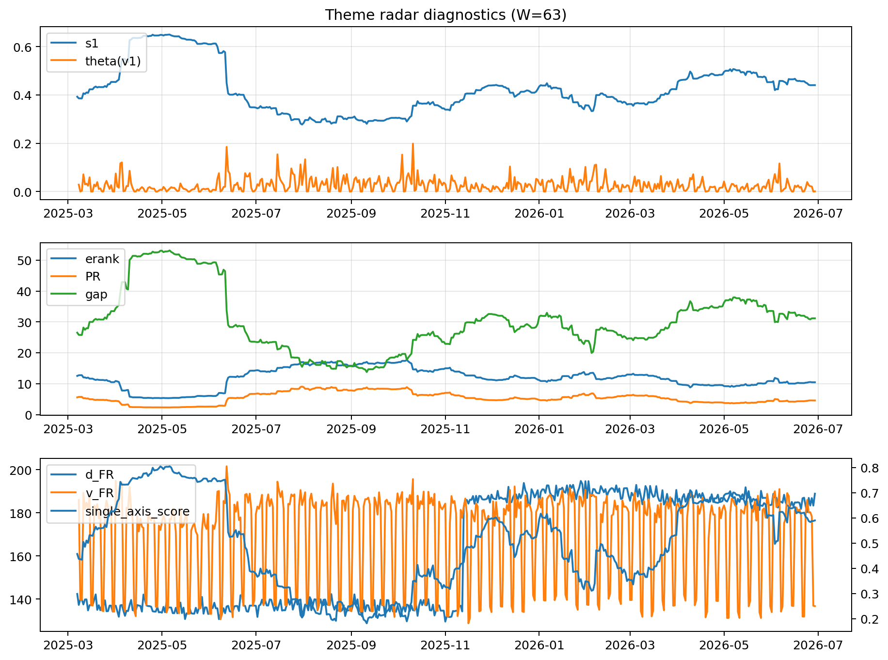

# Theme Radar Daily Brief — 2026-06-29

## Leaders (v1) — W=63
- **Nuclear_Uranium** (0.0825924727829566)
- Semis (0.0623737190868923)
- Metals (0.0542999019622319)

## Challengers — W=63
**v2:** Semis (0.0763577691610501), DataCenter_Infra (0.0624405015288961), Software_Cloud (0.055866139411551)
**v3:** Software_Cloud (0.1107475597582667), MegaCap_AI (0.099392151149466), Grid_Power (0.0910290894883152)

## Migration (20D slope) — W=63
**Top risers:**
- axis_Grid_Power: 0.0002185534333537
- axis_Semis: 0.0002040437143192
- axis_Critical_Minerals: 0.0001820674536724
- axis_Space: 0.0001597711823247
- axis_Quantum: 0.0001563172295247
- axis_Drones_Autonomy: 0.0001303512712809
- axis_Sector_ConsStap: 0.0001199794931147
- axis_Clean_Broad: 0.000116995254318
- axis_Nuclear_Uranium: 0.0001137667241906
- axis_Clean_Solar: 6.923353479586649e-05

**Top fallers:**
- axis_USD: -9.459118336158257e-05
- axis_Sector_Comm: -0.0001028049833552
- axis_Sector_Fin: -0.0001424569303007
- axis_MegaCap_AI: -0.0001447620027377
- axis_Genomics_Bio: -0.000149917137175
- axis_Sector_Health: -0.0001790622793799
- axis_Sector_RealEstate: -0.0002006123907421
- axis_DataCenter_Infra: -0.0002016407535416
- axis_Commodities: -0.0002119981169728
- axis_Rates: -0.0004939860829436

## Risk line (W=63)
- s1: 0.4404568125999031
- theta_v1: 0.0007576175952161
- v_FR: 136.788328832688
- single_axis_score: 0.5900000000000001

## Interpretation
**Regime:** `theme_migration`

- Action: Tomorrow watchlist: Grid_Power, Semis, Critical_Minerals, Space, Quantum + v2_top1=Semis
- Action: Hedge note: normal correlation stability.

- Percentiles (W=63 history): vfr_pct=0.15, theta_pct=0.19, s1_pct=0.66, score_pct=0.64.

---
**BUNDLE_ROOT_SHA256:** `a4e52928186638683aefa17aa1438ca6a535bbe034d71c5d3be2d38923b53043`
