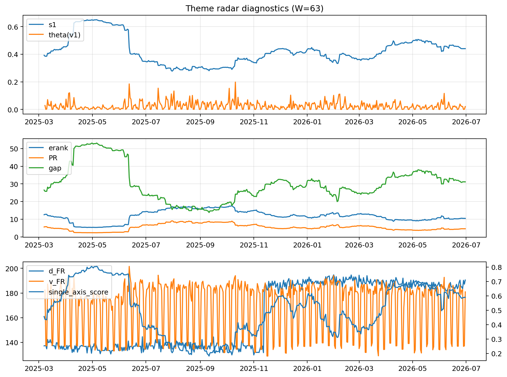

# Theme Radar Daily Brief — 2026-06-30

## Leaders (v1) — W=63
- **Nuclear_Uranium** (0.081786339490456)
- Semis (0.0629298897226589)
- Metals (0.0531928757640835)

## Challengers — W=63
**v2:** Semis (0.0750549912034081), Software_Cloud (0.0646081137043304), DataCenter_Infra (0.0645494095791687)
**v3:** Software_Cloud (0.0978654581584008), MegaCap_AI (0.0946581773387304), Grid_Power (0.0858322892589379)

## Migration (20D slope) — W=63
**Top risers:**
- axis_Semis: 0.0002285772489792
- axis_Grid_Power: 0.0002155747339114
- axis_Critical_Minerals: 0.0001847933790609
- axis_Space: 0.0001686991454844
- axis_Quantum: 0.000166520101057
- axis_Nuclear_Uranium: 0.000134142349752
- axis_Drones_Autonomy: 0.0001190031941895
- axis_Clean_Broad: 0.0001172554101622
- axis_Sector_ConsStap: 8.763745608200092e-05
- axis_Clean_Solar: 6.936920060886991e-05

**Top fallers:**
- axis_USD: -7.486287311425184e-05
- axis_Sector_Comm: -9.256773562725442e-05
- axis_Sector_Fin: -0.0001208943129855
- axis_Genomics_Bio: -0.000121423245311
- axis_MegaCap_AI: -0.0001591103399592
- axis_DataCenter_Infra: -0.0001759497310319
- axis_Sector_RealEstate: -0.0001778197159261
- axis_Sector_Health: -0.0001782814432953
- axis_Commodities: -0.0002090274181353
- axis_Rates: -0.0005325820844083

## Risk line (W=63)
- s1: 0.440424433021732
- theta_v1: 0.0206851075580861
- v_FR: 180.92381881257825
- single_axis_score: 0.5891891891891893

## Interpretation
**Regime:** `theme_migration`

- Action: Tomorrow watchlist: Semis, Grid_Power, Critical_Minerals, Space, Quantum + v2_top1=Semis
- Action: Hedge note: normal correlation stability.

- Percentiles (W=63 history): vfr_pct=0.51, theta_pct=0.53, s1_pct=0.66, score_pct=0.64.

---
**BUNDLE_ROOT_SHA256:** `6f4a7d6dd20f9a1824075a3680dbd8d95fb843719a4dcf4c5ec90a0d94855b6a`
