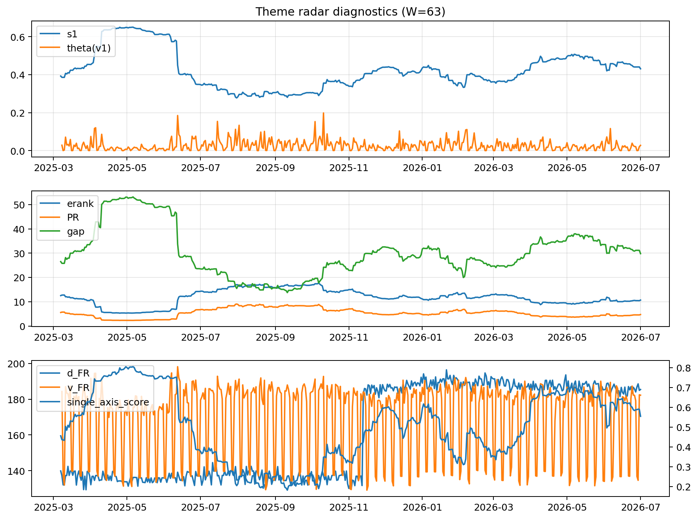

# Theme Radar Daily Brief — 2026-07-01

## Leaders (v1) — W=63
- **Nuclear_Uranium** (0.0821163723429191)
- Semis (0.0632468185229856)
- Metals (0.0536266625941951)

## Challengers — W=63
**v2:** Semis (0.0802575311608846), DataCenter_Infra (0.0770745788648453), Rates (0.0634337974401481)
**v3:** Software_Cloud (0.1122938343638472), MegaCap_AI (0.0977493615570807), Grid_Power (0.0912250182964902)

## Migration (20D slope) — W=63
**Top risers:**
- axis_Semis: 0.000244588190558
- axis_Grid_Power: 0.0002126555063206
- axis_Quantum: 0.0001926991152246
- axis_Critical_Minerals: 0.0001878628509619
- axis_Space: 0.0001799770310983
- axis_Nuclear_Uranium: 0.0001560873665538
- axis_Clean_Broad: 0.000120723630531
- axis_Drones_Autonomy: 0.0001030804885725
- axis_Sector_ConsStap: 9.931311709213336e-05
- axis_Robotics: 8.345978434645182e-05

**Top fallers:**
- axis_USD: -6.214191049122166e-05
- axis_Metals: -9.296129295545168e-05
- axis_Sector_Comm: -9.324462491900724e-05
- axis_Sector_Fin: -0.0001210310086711
- axis_MegaCap_AI: -0.0001593979908253
- axis_Sector_RealEstate: -0.0001694115783759
- axis_Sector_Health: -0.0001915329831441
- axis_DataCenter_Infra: -0.0002071799858542
- axis_Commodities: -0.0002455123878191
- axis_Rates: -0.0005778760884916

## Risk line (W=63)
- s1: 0.4308362500484244
- theta_v1: 0.0278345463487913
- v_FR: 182.28737235580823
- single_axis_score: 0.5543568464730291

## Interpretation
**Regime:** `theme_migration`

- Action: Tomorrow watchlist: Semis, Grid_Power, Quantum, Critical_Minerals, Space + v2_top1=Semis
- Action: Hedge note: normal correlation stability.

- Percentiles (W=63 history): vfr_pct=0.60, theta_pct=0.63, s1_pct=0.59, score_pct=0.59.

---
**BUNDLE_ROOT_SHA256:** `77ac39708141e4d66271a12416a056da60fbd31f06ea0f4731c40bfe002ac4d8`
