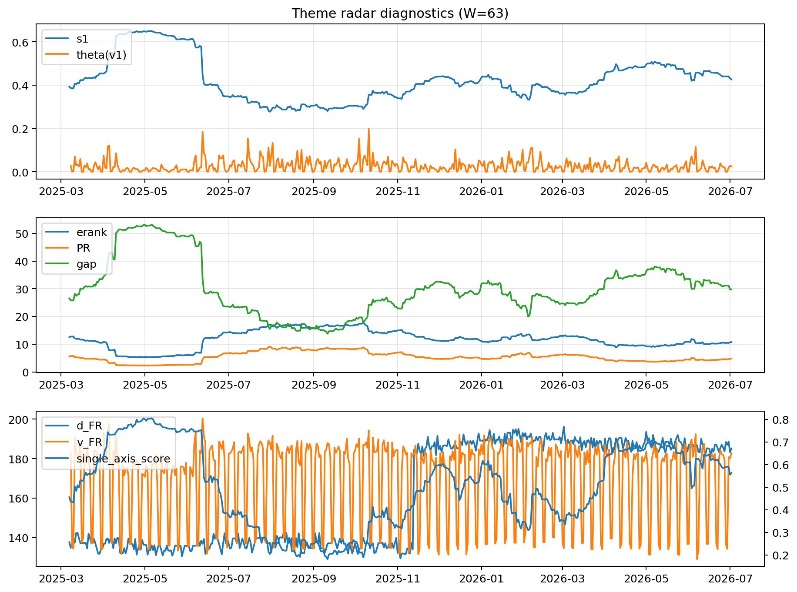

# Theme Radar Daily Brief — 2026-07-02

## Leaders (v1) — W=63
- **Nuclear_Uranium** (0.0824839971950929)
- Semis (0.0636747011077507)
- Metals (0.0535195592167794)

## Challengers — W=63
**v2:** Semis (0.0803487307987875), DataCenter_Infra (0.0790029378728732), Rates (0.061632411539076)
**v3:** Software_Cloud (0.1093513809628576), MegaCap_AI (0.0991237946108714), Grid_Power (0.088365955078987)

## Migration (20D slope) — W=63
**Top risers:**
- axis_Semis: 0.0002662392165639
- axis_Grid_Power: 0.0002230739976438
- axis_Space: 0.0002118797130907
- axis_Critical_Minerals: 0.0002087863148468
- axis_Quantum: 0.0001944023457131
- axis_Nuclear_Uranium: 0.0001627643159203
- axis_Clean_Broad: 0.0001381360792741
- axis_Sector_ConsStap: 0.0001116415828573
- axis_Drones_Autonomy: 9.308424954249392e-05
- axis_Robotics: 9.147796706155602e-05

**Top fallers:**
- axis_Credit: -6.627337434910284e-05
- axis_Sector_Comm: -0.0001057744517768
- axis_Metals: -0.0001152190352246
- axis_Sector_Fin: -0.0001250367132987
- axis_Sector_RealEstate: -0.0001696419734941
- axis_MegaCap_AI: -0.0001806179261934
- axis_Sector_Health: -0.0001984988611534
- axis_DataCenter_Infra: -0.0002245244496929
- axis_Commodities: -0.0002787968782193
- axis_Rates: -0.0005983270244515

## Risk line (W=63)
- s1: 0.427221252321065
- theta_v1: 0.0249792077009032
- v_FR: 182.8582828117437
- single_axis_score: 0.5627329192546584

## Interpretation
**Regime:** `theme_migration`

- Action: Tomorrow watchlist: Semis, Grid_Power, Space, Critical_Minerals, Quantum + v2_top1=Semis
- Action: Hedge note: normal correlation stability.

- Percentiles (W=63 history): vfr_pct=0.63, theta_pct=0.59, s1_pct=0.58, score_pct=0.60.

---
**BUNDLE_ROOT_SHA256:** `9b1f18b901c776a31ced6ddfab59b8fb6ae417d3b9951f883e05b07836f7bc02`
