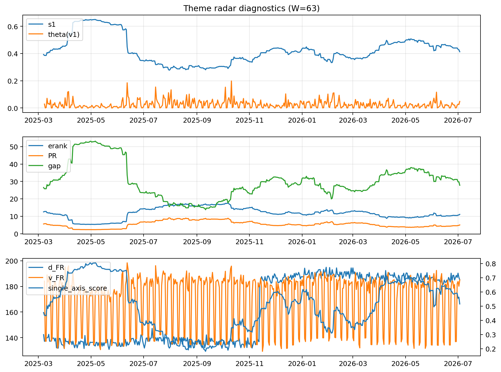

# Theme Radar Daily Brief — 2026-07-03

## Leaders (v1) — W=63
- **Nuclear_Uranium** (0.0819684989524467)
- Semis (0.0649079687034333)
- Grid_Power (0.0528644192177182)

## Challengers — W=63
**v2:** Semis (0.0917106224477046), Rates (0.0676401604218182), DataCenter_Infra (0.0642328851959769)
**v3:** Software_Cloud (0.1233246232165148), MegaCap_AI (0.0911163625508934), Crypto (0.0823124992160935)

## Migration (20D slope) — W=63
**Top risers:**
- axis_Semis: 0.0003002539104813
- axis_Critical_Minerals: 0.0002275442613014
- axis_Grid_Power: 0.0002164960536413
- axis_Space: 0.0002111835758011
- axis_Quantum: 0.0001866433255833
- axis_Nuclear_Uranium: 0.0001582448999363
- axis_Clean_Broad: 0.0001524591496022
- axis_Sector_ConsStap: 0.0001457307172721
- axis_Equity_US: 0.0001083171569123
- axis_Robotics: 9.842326175536545e-05

**Top fallers:**
- axis_Crypto: -0.0001009697357735
- axis_Sector_Comm: -0.0001216562036152
- axis_Sector_Fin: -0.000128582140228
- axis_Metals: -0.00015082935601
- axis_MegaCap_AI: -0.0001654106353226
- axis_Sector_Health: -0.0001822543763731
- axis_Sector_RealEstate: -0.0001844314613658
- axis_DataCenter_Infra: -0.0002469909784102
- axis_Commodities: -0.0003031169987263
- axis_Rates: -0.0005975038942543

## Risk line (W=63)
- s1: 0.4128942914528589
- theta_v1: 0.0480297943095042
- v_FR: 185.04927620022343
- single_axis_score: 0.5152892561983471

## Interpretation
**Regime:** `theme_migration`

- Action: Tomorrow watchlist: Semis, Critical_Minerals, Grid_Power, Space, Quantum + v2_top1=Semis
- Action: Hedge note: normal correlation stability.

- Percentiles (W=63 history): vfr_pct=0.77, theta_pct=0.84, s1_pct=0.52, score_pct=0.49.

---
**BUNDLE_ROOT_SHA256:** `7c112829561298fb6dc16621b2f04371b85200c6b4907e50f06130d788840786`
