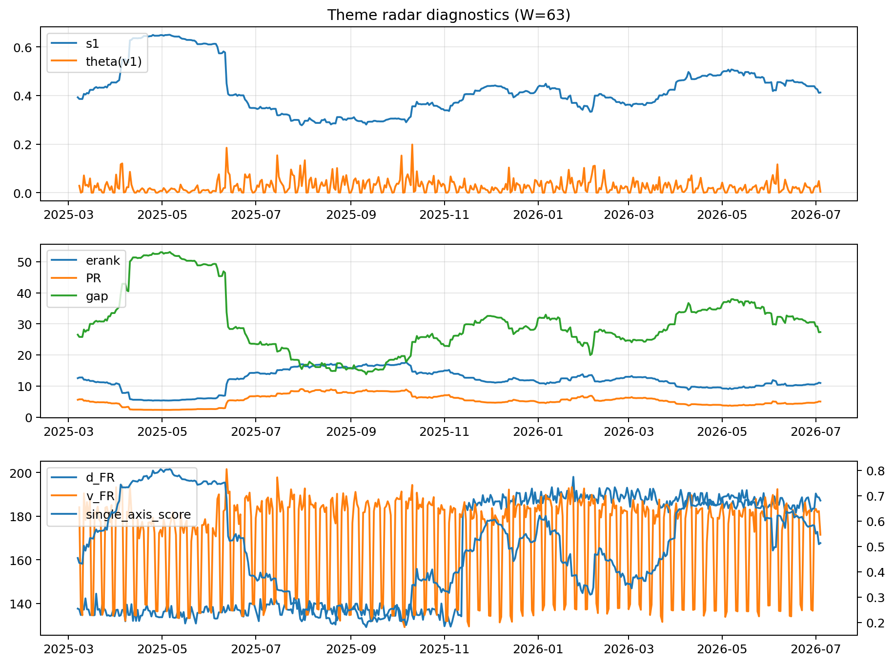

# Theme Radar Daily Brief — 2026-07-04

## Leaders (v1) — W=63
- **Nuclear_Uranium** (0.0823399080459594)
- Semis (0.064654602342525)
- Grid_Power (0.0531397468200447)

## Challengers — W=63
**v2:** Semis (0.0878746509081573), Rates (0.0788698978052973), DataCenter_Infra (0.0653146384483104)
**v3:** Software_Cloud (0.1190225523645663), MegaCap_AI (0.0935640995563332), Crypto (0.0838467103357952)

## Migration (20D slope) — W=63
**Top risers:**
- axis_Semis: 0.0003283479904062
- axis_Critical_Minerals: 0.0002372680135273
- axis_Grid_Power: 0.0002031395783374
- axis_Space: 0.0001978215774633
- axis_Sector_ConsStap: 0.0001782285361003
- axis_Quantum: 0.0001675743478126
- axis_Clean_Broad: 0.0001587959191345
- axis_Nuclear_Uranium: 0.000145436390997
- axis_Equity_US: 0.0001253359057969
- axis_Robotics: 0.0001024177970878

**Top fallers:**
- axis_Sector_Fin: -0.000127647918336
- axis_Sector_Comm: -0.000137177582842
- axis_Crypto: -0.0001475393251407
- axis_MegaCap_AI: -0.0001593901632811
- axis_Sector_Health: -0.0001704243559838
- axis_Metals: -0.0001841828773642
- axis_Sector_RealEstate: -0.0001953231128034
- axis_DataCenter_Infra: -0.0002659826507647
- axis_Commodities: -0.0003191489056987
- axis_Rates: -0.0005247653676161

## Risk line (W=63)
- s1: 0.4123184701946618
- theta_v1: 0.0038213757213177
- v_FR: 171.48733204489648
- single_axis_score: 0.51340206185567

## Interpretation
**Regime:** `theme_migration`

- Action: Tomorrow watchlist: Semis, Critical_Minerals, Grid_Power, Space, Sector_ConsStap + v2_top1=Semis
- Action: Hedge note: normal correlation stability.

- Percentiles (W=63 history): vfr_pct=0.30, theta_pct=0.27, s1_pct=0.52, score_pct=0.49.

---
**BUNDLE_ROOT_SHA256:** `33f0af888dd2a411fdd3499bd7f1849d32f309101bb6cbfd1d5f4877664791cc`
