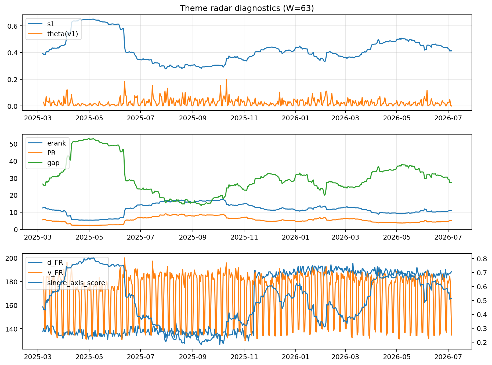

# Theme Radar Daily Brief — 2026-07-05

## Leaders (v1) — W=63
- **Nuclear_Uranium** (0.0823421322569445)
- Semis (0.0646563150638193)
- Grid_Power (0.0531415519276089)

## Challengers — W=63
**v2:** Semis (0.0878712876217016), Rates (0.0788759122288901), DataCenter_Infra (0.0653205558312286)
**v3:** Software_Cloud (0.1190236599531048), MegaCap_AI (0.0935784162932599), Crypto (0.0838058314425925)

## Migration (20D slope) — W=63
**Top risers:**
- axis_Semis: 0.0003432488984537
- axis_Critical_Minerals: 0.0002410495069646
- axis_Sector_ConsStap: 0.0002025419918365
- axis_Space: 0.000191701134823
- axis_Grid_Power: 0.0001856134145651
- axis_Clean_Broad: 0.0001633565841644
- axis_Quantum: 0.0001474261189514
- axis_Equity_US: 0.0001413810758534
- axis_Nuclear_Uranium: 0.0001368696323912
- axis_Robotics: 0.0001031423835992

**Top fallers:**
- axis_Sector_Fin: -0.0001214522275519
- axis_Sector_Comm: -0.00014416939488
- axis_MegaCap_AI: -0.0001450320641848
- axis_Sector_Health: -0.0001498099589259
- axis_Crypto: -0.0001854756566899
- axis_Sector_RealEstate: -0.0001965300199537
- axis_Metals: -0.0002096489013346
- axis_DataCenter_Infra: -0.0002703442529227
- axis_Commodities: -0.000330432769294
- axis_Rates: -0.0005033305568905

## Risk line (W=63)
- s1: 0.412311021793439
- theta_v1: 0.0001022902635392
- v_FR: 134.52618157088082
- single_axis_score: 0.5127572016460905

## Interpretation
**Regime:** `theme_migration`

- Action: Tomorrow watchlist: Semis, Critical_Minerals, Sector_ConsStap, Space, Grid_Power + v2_top1=Semis
- Action: Hedge note: normal correlation stability.

- Percentiles (W=63 history): vfr_pct=0.10, theta_pct=0.07, s1_pct=0.52, score_pct=0.49.

---
**BUNDLE_ROOT_SHA256:** `71bab582521e91bccff69af8a58c933226dca1bcd26f4ef11535ae198dbb5569`
