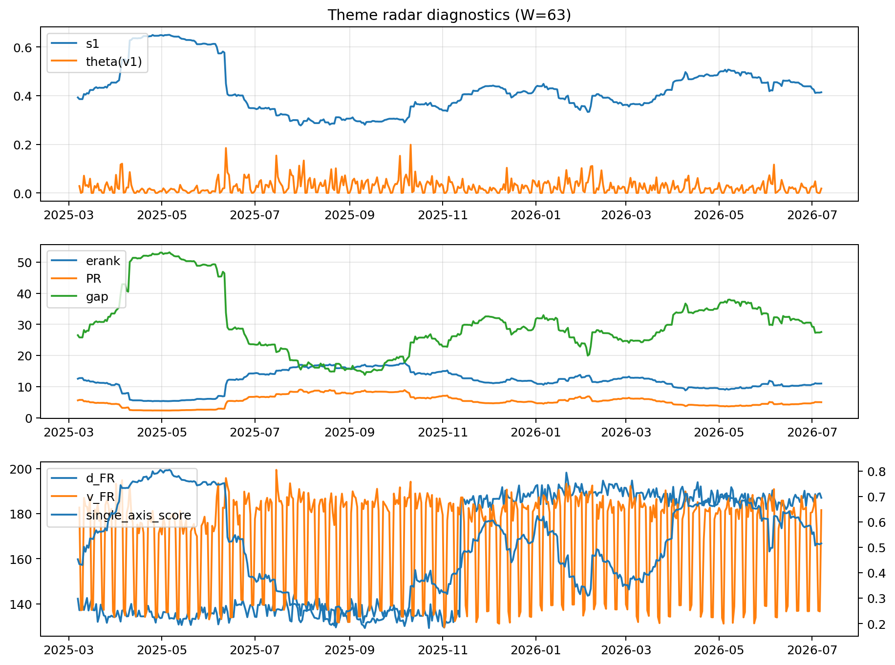

# Theme Radar Daily Brief — 2026-07-07

## Leaders (v1) — W=63
- **Nuclear_Uranium** (0.0821507001154122)
- Semis (0.0647852864789947)
- Grid_Power (0.0533039232020306)

## Challengers — W=63
**v2:** Semis (0.0883892462174543), Rates (0.077059871320353), DataCenter_Infra (0.0645451845071288)
**v3:** Software_Cloud (0.1204802375741542), MegaCap_AI (0.0930120930029209), Grid_Power (0.0813144744848332)

## Migration (20D slope) — W=63
**Top risers:**
- axis_Semis: 0.0003685577810618
- axis_Sector_ConsStap: 0.0002375085315481
- axis_Critical_Minerals: 0.0002256761266525
- axis_Clean_Broad: 0.0001590308111591
- axis_Grid_Power: 0.0001587635346104
- axis_Equity_US: 0.0001557108757071
- axis_Space: 0.0001288862368893
- axis_Nuclear_Uranium: 0.0001174317440942
- axis_Cyber: 0.0001115380764335
- axis_Sector_Tech: 0.000109026856858

**Top fallers:**
- axis_Sector_Health: -0.0001111633462028
- axis_Sector_Fin: -0.000112261331489
- axis_Sector_Comm: -0.0001501701169476
- axis_Sector_Utilities: -0.0001574113497773
- axis_Crypto: -0.000209540485003
- axis_Sector_RealEstate: -0.0002125466366615
- axis_Metals: -0.0002231799194341
- axis_DataCenter_Infra: -0.0002866539046842
- axis_Commodities: -0.0003079430847899
- axis_Rates: -0.0004595924272893

## Risk line (W=63)
- s1: 0.4138725721671522
- theta_v1: 0.0183912012992067
- v_FR: 181.56780728179825
- single_axis_score: 0.5151639344262294

## Interpretation
**Regime:** `theme_migration`

- Action: Tomorrow watchlist: Semis, Sector_ConsStap, Critical_Minerals, Clean_Broad, Grid_Power + v2_top1=Semis
- Action: Hedge note: normal correlation stability.

- Percentiles (W=63 history): vfr_pct=0.53, theta_pct=0.48, s1_pct=0.53, score_pct=0.50.

---
**BUNDLE_ROOT_SHA256:** `96e8ffb185e3d9f8896228134dda5f38c65dbe4a2c71ade8b4258359e128dfba`
