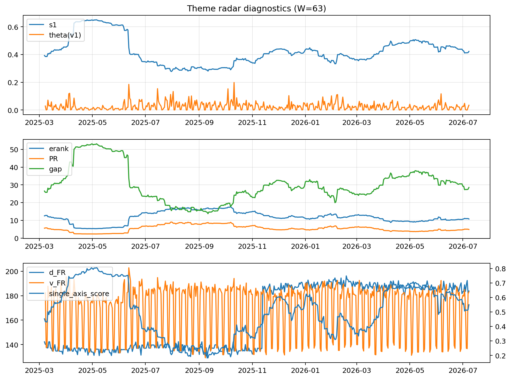

# Theme Radar Daily Brief — 2026-07-08

## Leaders (v1) — W=63
- **Nuclear_Uranium** (0.0840916051073713)
- Semis (0.0648731599652667)
- Grid_Power (0.0538343658873493)

## Challengers — W=63
**v2:** Semis (0.0889173491453494), Rates (0.0752404605937409), DataCenter_Infra (0.0662957029136143)
**v3:** Software_Cloud (0.1232605692456244), MegaCap_AI (0.0941499339096737), Grid_Power (0.0800093104112033)

## Migration (20D slope) — W=63
**Top risers:**
- axis_Semis: 0.0003546618742638
- axis_Sector_ConsStap: 0.000239884857375
- axis_Critical_Minerals: 0.0002130617543569
- axis_Grid_Power: 0.0001646235722182
- axis_Clean_Broad: 0.0001549442376904
- axis_Equity_US: 0.0001514959408189
- axis_Cyber: 0.0001386700790645
- axis_Nuclear_Uranium: 0.00012825447215
- axis_Sector_Tech: 0.0001096428559037
- axis_Equity_ExUS: 0.0001023885961411

**Top fallers:**
- axis_Drones_Autonomy: -9.14646211377492e-05
- axis_Sector_Fin: -0.0001024793754345
- axis_Sector_Comm: -0.0001628218082747
- axis_Sector_Utilities: -0.0001706191616927
- axis_Crypto: -0.0001935034373502
- axis_Sector_RealEstate: -0.000205929617547
- axis_Metals: -0.0002371608829721
- axis_Commodities: -0.0002871483210452
- axis_DataCenter_Infra: -0.0003362867916078
- axis_Rates: -0.0004251990660255

## Risk line (W=63)
- s1: 0.4224890916664442
- theta_v1: 0.0345020644368167
- v_FR: 183.1769708782287
- single_axis_score: 0.5496932515337423

## Interpretation
**Regime:** `theme_migration`

- Action: Tomorrow watchlist: Semis, Sector_ConsStap, Critical_Minerals, Grid_Power, Clean_Broad + v2_top1=Semis
- Action: Hedge note: normal correlation stability.

- Percentiles (W=63 history): vfr_pct=0.65, theta_pct=0.74, s1_pct=0.55, score_pct=0.57.

---
**BUNDLE_ROOT_SHA256:** `214fbb684b1c2853bb7fb3f5c8fce481cfbe8ff97cfc44ea9c9cc0d98ab5add8`
