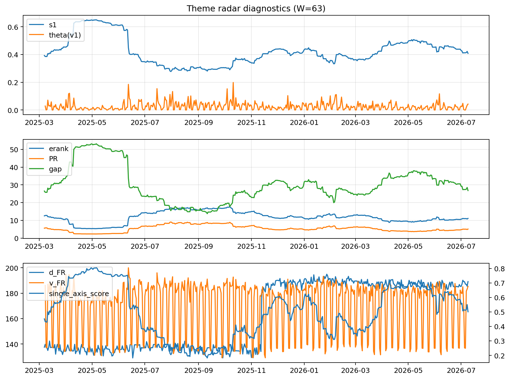

# Theme Radar Daily Brief — 2026-07-09

## Leaders (v1) — W=63
- **Nuclear_Uranium** (0.0830380916218484)
- Semis (0.0647390691604927)
- Grid_Power (0.0542785525069951)

## Challengers — W=63
**v2:** Semis (0.0915024515104021), Rates (0.0732237924588316), MegaCap_AI (0.0642326866877007)
**v3:** Software_Cloud (0.1204040860259578), MegaCap_AI (0.0898298737983463), Grid_Power (0.0776047006046768)

## Migration (20D slope) — W=63
**Top risers:**
- axis_Semis: 0.0003379090769397
- axis_Sector_ConsStap: 0.0002451296666008
- axis_Critical_Minerals: 0.0001983726859177
- axis_Cyber: 0.0001877624389211
- axis_Grid_Power: 0.0001705223404284
- axis_Clean_Broad: 0.000170020995124
- axis_Equity_US: 0.0001519005107558
- axis_Nuclear_Uranium: 0.0001204180322511
- axis_Sector_Tech: 0.0001096780837665
- axis_Equity_ExUS: 0.0001004544908646

**Top fallers:**
- axis_Sector_Fin: -9.557476582085846e-05
- axis_Drones_Autonomy: -0.0001189414784991
- axis_Crypto: -0.0001642612480986
- axis_Sector_Utilities: -0.0001730957833563
- axis_Sector_Comm: -0.0001774769731001
- axis_Sector_RealEstate: -0.0001826124440217
- axis_Metals: -0.0002732458633849
- axis_Commodities: -0.0002992260684884
- axis_Rates: -0.0003797176664428
- axis_DataCenter_Infra: -0.000385762393767

## Risk line (W=63)
- s1: 0.4084216252116899
- theta_v1: 0.0425462900841444
- v_FR: 185.3668402636772
- single_axis_score: 0.5008163265306123

## Interpretation
**Regime:** `theme_migration`

- Action: Tomorrow watchlist: Semis, Sector_ConsStap, Critical_Minerals, Cyber, Grid_Power + v2_top1=Semis
- Action: Hedge note: normal correlation stability.

- Percentiles (W=63 history): vfr_pct=0.77, theta_pct=0.80, s1_pct=0.50, score_pct=0.48.

---
**BUNDLE_ROOT_SHA256:** `747a2679fc6736c872c15eeedbfebd56b6fbdcdc1fb955fca22a50359f5ec8d9`
