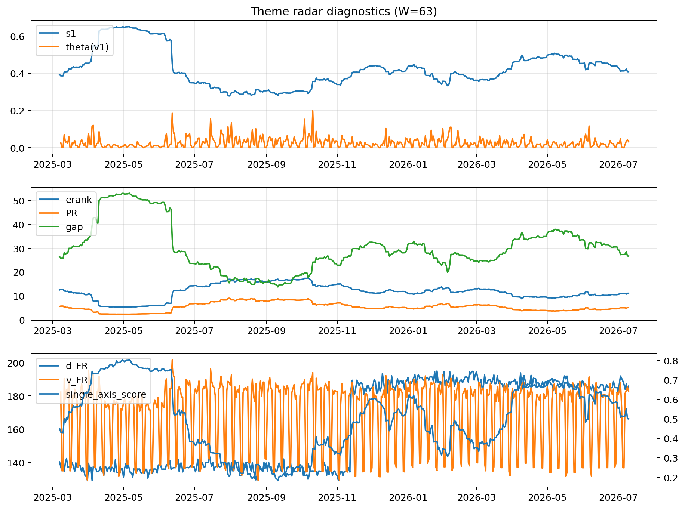

# Theme Radar Daily Brief — 2026-07-10

## Leaders (v1) — W=63
- **Nuclear_Uranium** (0.0825848904879628)
- Semis (0.0646819249014599)
- Grid_Power (0.0536305047240929)

## Challengers — W=63
**v2:** Semis (0.0907029157795775), Rates (0.0721106769255599), MegaCap_AI (0.0661533277305403)
**v3:** Software_Cloud (0.1180680661653407), MegaCap_AI (0.0828798878065989), Grid_Power (0.074413357140307)

## Migration (20D slope) — W=63
**Top risers:**
- axis_Semis: 0.000312314383325
- axis_Cyber: 0.0002687512038045
- axis_Sector_ConsStap: 0.0002600447008965
- axis_Critical_Minerals: 0.0001875351236645
- axis_Clean_Broad: 0.000183512536084
- axis_Grid_Power: 0.0001587087982725
- axis_Equity_US: 0.0001524916353007
- axis_Software_Cloud: 0.0001343187543247
- axis_Sector_Tech: 0.000110323915031
- axis_Nuclear_Uranium: 0.0001082349242974

**Top fallers:**
- axis_Sector_Materials: -9.14919407374844e-05
- axis_Drones_Autonomy: -0.0001424803604156
- axis_Crypto: -0.0001543953992692
- axis_Sector_RealEstate: -0.0001573897311377
- axis_Sector_Utilities: -0.0001786886080395
- axis_Sector_Comm: -0.0001814065491133
- axis_Metals: -0.0002883830956229
- axis_Commodities: -0.0003113730058548
- axis_Rates: -0.0003354749847093
- axis_DataCenter_Infra: -0.0004438523742601

## Risk line (W=63)
- s1: 0.4080596363740147
- theta_v1: 0.0329051677800794
- v_FR: 182.68043209723857
- single_axis_score: 0.4997963340122199

## Interpretation
**Regime:** `theme_migration`

- Action: Tomorrow watchlist: Semis, Cyber, Sector_ConsStap, Critical_Minerals, Clean_Broad + v2_top1=Semis
- Action: Hedge note: normal correlation stability.

- Percentiles (W=63 history): vfr_pct=0.62, theta_pct=0.71, s1_pct=0.49, score_pct=0.48.

---
**BUNDLE_ROOT_SHA256:** `a0a7c79e55aee1719c9dfa5210e9030b86414823618947733e2f09c9b4a889ae`
