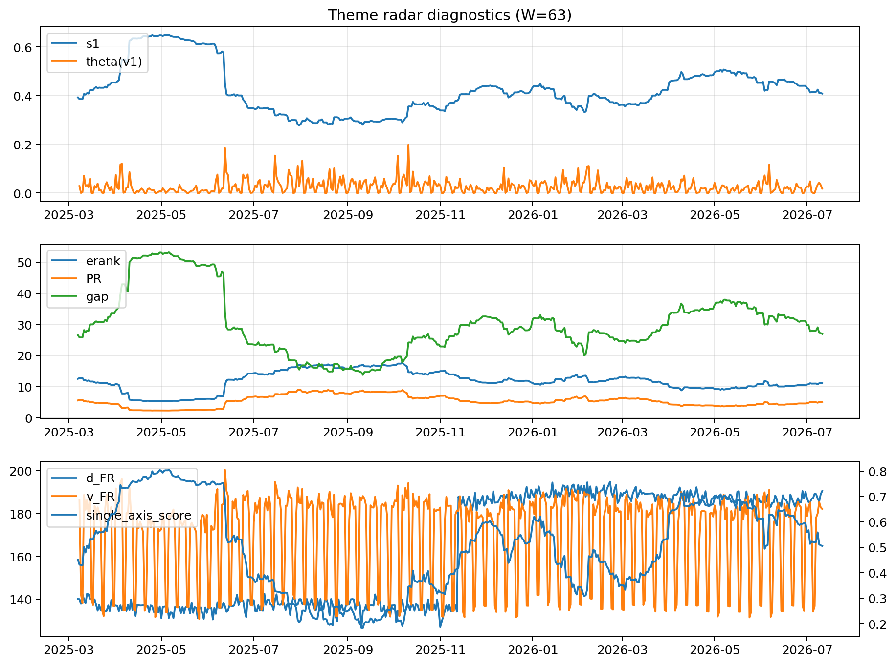

# Theme Radar Daily Brief — 2026-07-11

## Leaders (v1) — W=63
- **Nuclear_Uranium** (0.0845691329580356)
- Semis (0.064759480964561)
- Grid_Power (0.0538869363541905)

## Challengers — W=63
**v2:** Semis (0.0922320724286889), MegaCap_AI (0.0696760976293366), Rates (0.0619193872863839)
**v3:** Software_Cloud (0.1177864413685206), MegaCap_AI (0.0761154309766563), Cyber (0.069622693621028)

## Migration (20D slope) — W=63
**Top risers:**
- axis_Cyber: 0.0003230664353144
- axis_Semis: 0.00026919879794
- axis_Sector_ConsStap: 0.0002655127342862
- axis_Software_Cloud: 0.0002129127876522
- axis_Clean_Broad: 0.0001893401572055
- axis_Critical_Minerals: 0.0001707260585828
- axis_Grid_Power: 0.0001459003688695
- axis_Equity_US: 0.0001444569961086
- axis_Nuclear_Uranium: 0.0001237622769503
- axis_Sector_Tech: 0.0001051845116878

**Top fallers:**
- axis_Sector_RealEstate: -0.0001165526058194
- axis_Genomics_Bio: -0.000128848763645
- axis_Crypto: -0.0001562446827168
- axis_Drones_Autonomy: -0.0001629790084105
- axis_Sector_Utilities: -0.0001640738635857
- axis_Sector_Comm: -0.0001783382726799
- axis_Rates: -0.0002859593843984
- axis_Metals: -0.0003005783004226
- axis_Commodities: -0.0003150448615272
- axis_DataCenter_Infra: -0.0004861189288496

## Risk line (W=63)
- s1: 0.4083503682408292
- theta_v1: 0.0177451437938383
- v_FR: 182.10349638535064
- single_axis_score: 0.5052845528455284

## Interpretation
**Regime:** `theme_migration`

- Action: Tomorrow watchlist: Cyber, Semis, Sector_ConsStap, Software_Cloud, Clean_Broad + v2_top1=Semis
- Action: Hedge note: normal correlation stability.

- Percentiles (W=63 history): vfr_pct=0.59, theta_pct=0.46, s1_pct=0.49, score_pct=0.48.

---
**BUNDLE_ROOT_SHA256:** `0918350cc0c050d75c64c16bfa67946b783f15a66cf7ee57a7fed4605388ee50`
