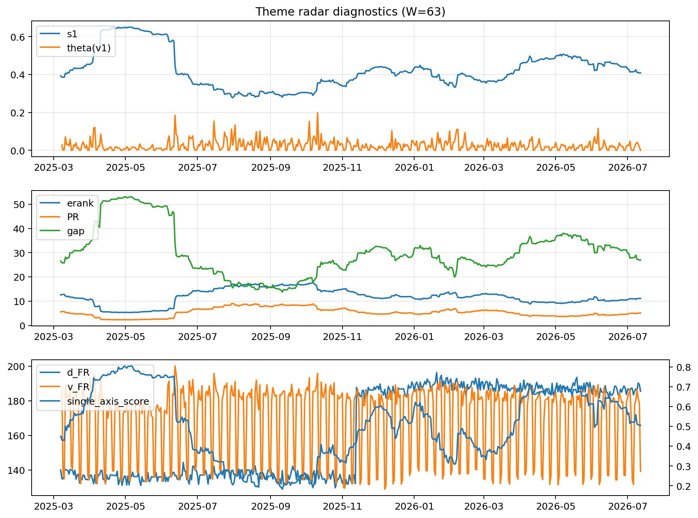

# Theme Radar Daily Brief — 2026-07-12

## Leaders (v1) — W=63
- **Nuclear_Uranium** (0.0845662546414616)
- Semis (0.0647589457385191)
- Grid_Power (0.0538854600775018)

## Challengers — W=63
**v2:** Semis (0.0922215118339909), MegaCap_AI (0.0696745058211318), Rates (0.0619078465527993)
**v3:** Software_Cloud (0.1177892577162951), MegaCap_AI (0.0760995508073525), Cyber (0.0696340501486315)

## Migration (20D slope) — W=63
**Top risers:**
- axis_Cyber: 0.0003697851496559
- axis_Software_Cloud: 0.0002786234710364
- axis_Sector_ConsStap: 0.0002662941864817
- axis_Semis: 0.0002265430929
- axis_Clean_Broad: 0.0001917277127827
- axis_Critical_Minerals: 0.0001528008065316
- axis_Equity_US: 0.0001365062216848
- axis_Nuclear_Uranium: 0.0001341368175011
- axis_Grid_Power: 0.0001323172101891
- axis_Sector_Tech: 9.976593579037018e-05

**Top fallers:**
- axis_Sector_Materials: -0.0001156947192698
- axis_Crypto: -0.0001533155339614
- axis_Sector_Utilities: -0.0001587817615116
- axis_Sector_Comm: -0.000170794585924
- axis_Drones_Autonomy: -0.0001793606128257
- axis_Genomics_Bio: -0.0002098080827943
- axis_Rates: -0.0002189657093853
- axis_Metals: -0.0003033651981994
- axis_Commodities: -0.0003059130377876
- axis_DataCenter_Infra: -0.0005178789254737

## Risk line (W=63)
- s1: 0.4083547710807576
- theta_v1: 6.504021620166936e-05
- v_FR: 139.22256005251634
- single_axis_score: 0.5050709939148073

## Interpretation
**Regime:** `theme_migration`

- Action: Tomorrow watchlist: Cyber, Software_Cloud, Sector_ConsStap, Semis, Clean_Broad + v2_top1=Semis
- Action: Hedge note: normal correlation stability.

- Percentiles (W=63 history): vfr_pct=0.23, theta_pct=0.03, s1_pct=0.49, score_pct=0.48.

---
**BUNDLE_ROOT_SHA256:** `630de19f1fb9bc83d1212ee2292b87b10bc6baf77b1696b5aadd945453b2761d`
